

# Fundamental Mathematics

**Content**

> - [Differential equations and physics](#differential-equation)
> - [Array and vector](#array-and-vector)
> - [Vector analysis](#vector-analysis)
> - Complex function theory
> - Fourier transform
> - Laplace transform

## Differential equation

***Linear differential equation***

: Differential equation defined by **linear polynomial** in the unknown function and its derivatives

- y^\'^ + ay = 0 `{ a is constant , eq.1.1}`
  - If  y~(x)~ satisfy above, y~(x)~ is called as **solution**
  - Solve above equation to obtain y~(x)~
  - Before that, y is called as **unknown function**

- Mission: solve function y^\'^ + ay = 0 `{ a is constant , eq.1.1}`
  - Use nature of exponential function
    - (e^ax^)^\'^ = ae^ax^
  - Multiple e^ax^ to `{eq.1.1: y^\'^ + ay = 0}`
    - e^ax^y^\'^ + ae^ax^y = 0
  - Recall the differential for products
    - (g~(x)~h~(x)~)^'^ = g~(x)~h~(x)~^'^ + g~(x)~^'^h~(x)~
  - `{eq.1.1: y^\'^ + ay = 0}` should be
    - (e^ax^y)^'^ = 0 &rarr; e^ax^y = c `{c is arbitrary constant}`
    - Solution w/o constant: **a general solution**
    - If c has some specific value &rarr; **a particular solution**
- Shape of function depends arbitrary constant `{Initial value problem}`
  - We may don’t know the arbitrary constant itself
  - We may know the value(𝑦~0~) on specific point(𝑥~0~)
    - 𝑦~0~ : Initial value or initial condition
    - y^\'^ + ay = 0, $𝑦_0 = y(x_0) = ce^{-ax_0}$
      - $c = y_0 e^{ax_0}$
  - General form of `{eq.1.1: y^\'^ + ay = 0}` should be
    - $y = y_0 e^{-a(x-x_0)}$

***Homogeneous differential***

- Think about following equation
  - $ y^{'} + ay = r_{(x)} $ `{eq.1.7}`
  - A differential equation is **homogeneous** when
    - $f_{(x,y)}dy = -g{(x,y)}dx$ &rarr; $f_{(x,y)} + g_{(x,y)}\frac{dx}{dy} = 0 $
    - If r~(x)~ = 0, `{eq.1.7 }` is homogeneous
  - If not, a differential equation is **inhomogeneous**
    - If $r_{(x)} \neq 0$ , `{eq.1.7}` is inhomogeneous
  - A general solution of inhomogeneous function `{eq.1.7}` is
    - $y = (\int r_{(x)}e^{ax}dx + c)e^{-ax}$
    - Multiple e^ax^ to `{eq.1.7}`
      - $(y^{'} + ay) e^{ax} = r_{(x)}e^{ax}$ &rarr; $(ye^{ax})^{'} = r_{x}e^{ax}$
    - Take integral
      - $ ye^{ax} = \int r_{(x)}e^{(ax)}dx +c$ `{c is constant}`
      - $y = (\int r_{(x)}e^{(ax)}dx +c)e^{-ax}$
    - 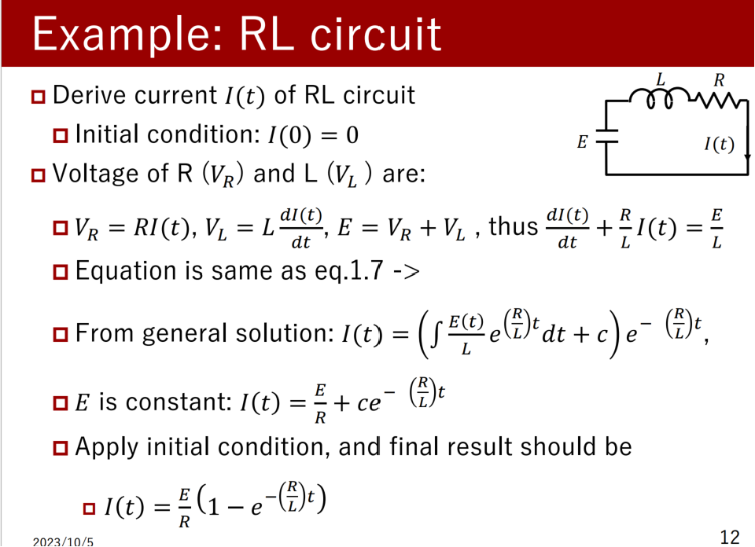

***Quiz***

- Solve a general form of following equations
  - $y^{'} - y = 0$
        $a = -1, y = ce^x $ `{c is arbitrary constatn}`
  - $y^{'} + y = 0$
        $a = 1, y = ce^{-x} $ `{c is arbitrary constatn}`

- Solve a initial value problem of following equations 
    $c = y_0 e^{ax_0}, y = y_0 e^{-a(x-x_0)}$

  - $y^{'} + y = 0, y_{(0)} = 2$
        $a = 1, y = ce^{-x} $ 
        $c = 2, y = 2e^{-x}$
  - $y^{'} - 2y = 0, y_{(1)} = 2$
        $a = -2, y = ce^{2x} $ 
        $c = \frac{2}{e^2}, y = 2e^{2(x-1)}$

- Generalize
    - 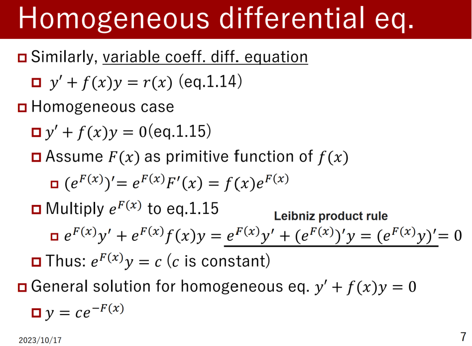
    - 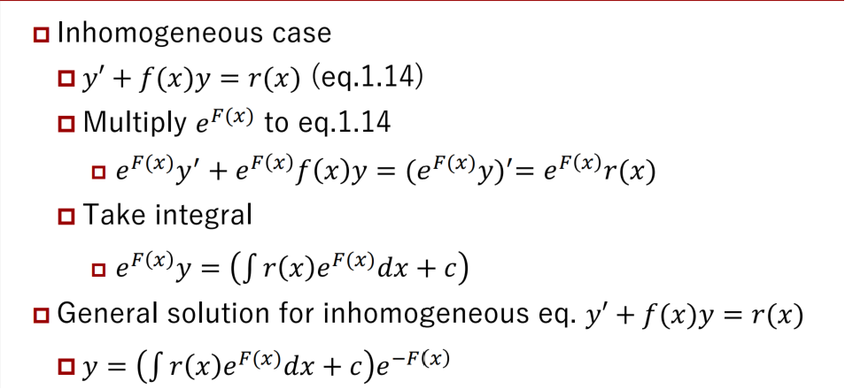

**Solution of differential equation**

- Constant coefficient 1st order differential equation
  - Homogeneous: $y^{'} + ay = 0 \leftrightarrow y = ce^{-ax}$ `{c is constant}`
  - Inhomogeneous:
    - $ y^{'} + ay =r_{(x)} \leftrightarrow y = (\int r_{(x)}e^{ax}dx +c)e^{-ax}$
  - Variable coefficient 1st order differential equation
    - Homogeneous: $y^{'} + f_{(x)}y = 0 \leftrightarrow y = ce^{-F_{(x)}}$
    - Inhomogeneous: $y^{'} + f_{(x)}y = r_{(x)} \leftrightarrow y = (\int r_{(x)}e^{F_{(x)}}dx +c)e^{-F_{(x)}}$

> - Variation of constants
> - Method of indeterminate coefficient

***Variation of constants***

: Can solve linear (inhomogeneous) differential equation
  - Difficulty to solve high order equation
  - Equation becomes complex for high order equation

- Strategy
  1. Change given inhomogeneous equation to homogeneous
  2. Solve general solution for the homogeneous equation
  3. Replace constant 𝑐 to function 𝑢(𝑥)
  4. Substitute 𝑢(𝑥) to given inhomogeneous equation
        - Calculate general solution of 𝑢(𝑥)
  5. Substitute 𝑢(𝑥) to solution of homogeneous equation

- Example: get general solution of :  $ y^{'} + f_{(x)}y = r_{(x)}$ `{eq.1.7}`
    1. Change given inhomogeneous equation to homogeneous
        - $ y^{'} + f_{(x)}y = 0 $
    2. Solve general solution for the homogeneous equation
        - Use this relationship: $(e^{F(x)})^{'} = e^{F_{(x)}}F^{'}_{(x)} = e^{F_{(x)}}f_{(x)}$
        - $e^{F_{(x)}}y^{'} + e^{F_{(x)}} f_{(x)}y = e^{F(x)}y^{'} + e^{F_{(x)}}(e^{F(x)})^{'}y=0$
        - thus, $(e^{F(x)}y)^{'} = 0 \rightarrow e^{F(x)}y = c$ `{c is constant}`
    3. Replace constant 𝑐 to function 𝑢(𝑥)
        - $y = ce^{-F(x)} \rightarrow y = u_{(x)}e^{-F(x)} \rightarrow u_{(x)} = ye^{+F(x)}$
    4. Substitute 𝑢(𝑥) to given inhomogeneous equation
        - $(u_{(x)}e^{-F(x)})^{'} + f_{(x)}u_{(x)}e^{-F(x)} = r_{(x)}$
        - $ u^{'}_{(x)}e^{-F(x)} - f_{(x)}u_{(x)}e^{-F(x)} + f_{(x)}u_{(x)}e^{-F(x)} = r_{(x)}$
        - $ u^{'}_{(x)} = r_{(x)}e^{F(x)} \rightarrow u_{(x)} = \int r_{(x)}e^{F_{(x)}}dx + C$`{c is constant}`
    5. Substitute 𝑢(𝑥) to solution of homogeneous equation
        - $y = u_{(x)}e^{-F(x)}= (\int r_{(x)}e^{F_{(x)}}dx + C)e^{-F(x)}$

***Method of indeterminate coefficient***

: With some assumptions, we can easily solve differential equation
: Guess the candidate of particular solution
: If the right side of an equation is
    - n-order polynormal: candidate should be n-polynormal
    - sine function: candidate should be in sine
    - exponential: candidate should be in exponential

- Example1: get general solution of: $y^{'}+3y = x^{2} -1$ `{eq.1.23}`
  - Assume particular solution is $ y_p = \alpha x^2 + \beta x + \gamma $
    - $\alpha, \beta, \gamma $ are constant. Substitute $y_p$ to `{eq.1.23}`
    - $y^{'}_p + 3y_p = (2 \alpha x + \beta) + 3(\alpha x^2 + \beta x + \gamma) = x^2 -1$
    - This equation should satisfy following conditions
      - $x^2 : 2\alpha = 1, x : 2\alpha + 3 \beta = 0, x^0: \beta + 3 \gamma = -1 $, thus
    - $y_p = \frac{1}{3} x^2 - \frac{2}{9} x - \frac{7}{27}$

  - If one particular solution is clear, general solution can be easily solved.
  - Example: get general solution of : $y^{'} + f_{(x)}y = r_{(x)}$
    - Assume particular solution 𝑦~𝑝~, general solution 𝑦, and its difference $y_h = y - y_p$ is
    -  $y^{'}_h + f_{(x)}y_h = (y-y_p)^{'} + f_{(x)}(y-y_p) = y^{'} + f_{(x)}y-(y^{'}_{p}+f_{(x)}y_p) = r_{(x)} - r_{(x)} = 0$ 
    -  This is homogeneous:$y_h = ce^{-F_{(x)}}$
    -  $\mathbf{y = y_p + y_h = y_p + ce^{-F_{(x)}}}$ `{c is constant}`
       -  we can use this as theorem
    -  general solution of `{eq.1.23}`:$y = \frac{1}{3} x^2 - \frac{2}{9} x - \frac{7}{27} + ce^{-3x}$

- Example2: get general solution of :$ y^{'} + 2y = \cos(x)$`{eq.1.25}`
  - Assume particular solution is $y_p = \alpha \cos x + \beta \sin x$
    - $\alpha , \beta$ are constant. Substitute y~p~ to `{eq.1.25}`
    - $y^{'}_p + 2y_p = - \alpha \sin x + \beta \cos x + 2(\alpha \cos c + \beta \sin x) = \cos x$
    - This equation should satisfy following conditions
    - $\cos x : 2\alpha + \beta = 1, \sin x : - \alpha + 2 \beta = 0$, thus
  - $y_p = \frac{2}{5} \cos x + \frac{1}{5} \sin x$
  - $y = \frac{2}{5} \cos x + \frac{1}{5} \sin x + ce^{-2x}$

- Example3: get general solution of : $y^{'} - y = 2e^{2x}$ `{eq.1.28}`
  - Assume particular solution is $y_p = \alpha e^{2x}$
    - &alpha; is constant. Substitute y~p~ to `{eq.1.28}`
    - $y^{'}_p - y_p = 2 \alpha e^{2x} - \alpha e^{2x} = \alpha e^{2x} = 2 e^{2x}$, thus
    -  $y_p = 2e^{2x}$
    -  $y = 2e^{2x} + ce^{x}$
    -  However, this is not true for all of solution
 -  Example: get general solution of : $y^{'} - 2y = 2e^{2x}$ `{eq.1.29}`
    -  Assume particular solution is $y_p = \alpha e^{2x}$
       -  &alpha; is constant. Substitute y~p~ to `{eq.1.29}`
       -  $y^{'}_p - y_p = 2\alpha e^{2x} - 2\alpha e^{2x} = 0 \rightarrow $ wrong  assumption
    -  Assume particular solution is $y_p = \alpha xe^{2x}$
       -  &alpha; is constant. Substitute y~p~ to `{eq.1.29}`
       -  $y^{'}_p - y_p = (\alpha e^{2x} + 2\alpha x e^{2x}) - 2\alpha x e^{2x} = 2e^{2x}$
       -  $y_p = 2xe^{2x}$
       -  $ y = (2x + c) e^{2x}$
    -  If general solution is $\mathbf{y^{'} + ay = ke^{-ax}}$, particular solution should be $y_p = kxe^{-ax}$
 -  **Exerceis(1)**
    -  Solve general solutions for following equations
       -  by Variation of constants method
          -  $y^{'} - xy = x$
                1. $f_{(x)} = -x, F_{(x)} = -\frac{1}{2}x^2, r_{(x)} = x $
                2. $u_{(x)} = \int r_{(x)}e^{F_{(x)}}dx + c, \\ y = u_{(x)} e^{-F_{(x)}} = (\int x e^{-\frac{1}{2}x^2}dx + c_1)e^{\frac{1}{2}x^2} = -1 + c_2 e^{\frac{x}{2}}$ 
                - `{c1, c2 is constant}`
          -  $y^{'} + \frac{y}{x} = x^2 +2x$

                1. $f_{(x)} = \frac{1}{x}, F_{(x)} = \ln x , \\ r_{(x)} = x^2 +2x$
                2. $y = \frac{\int (x^2 + 2x)xdx +c_1}{x} = \frac{x^3}{4} + \frac{2x^2}{3} + \frac{c_2}{x}$
       -  by Method of indeterminate coefficient
          -  $2y^{'} + 3y = 3x^2 + x$
               - Assuming the particular solution: $y_p = \alpha x^2 + \beta x + \gamma$
               - Substitute: $2(2\alpha x + \beta ) + 3(\alpha x^2 + \beta x + \gamma) = 3x^2 + x \\ 3\alpha =3, 4\alpha + 3\beta = 1, 2\beta + 3\gamma = 0 \\ \alpha =1, \beta = -1, \gamma = \frac{2}{3}$
               - $f_{(x)} = \frac{3}{2}, F_{(x)} = \frac{3}{2}x$
               - particular solution: $ y_p = x^2 -x + \frac{2}{3}$
               - general solution: $y_p = x^2 -x + \frac{2}{3} + ce^{-\frac{3}{2}x}$ `{c: const}`
          -  $y^{'} + 4y = 3e^{-x}$
             -  $y_p = \alpha e^{-x}$
             -  $ - \alpha e^{-x} + 4\alpha e^{-x} = 3 e^{-x}, \alpha = 1$
             -  $f_{(x)} = 4 , F_{(x)} = 4x$
             -  $y_p = e^{-x}, y = e^{-x} + ce^{-4x}$

***Euler's formula***
- The trigonometric functions (sin cos) and complex exponential function satisfy following relationship
  - $e^{ix} = \cos x + i\sin x$
  - 𝑒: base of natural logarithm, 𝑖(or 𝑗): imaginary unit
- Euler’s formula is useful for circuit analysis, cause
  - Easy to take integral, differential
    - $\frac{d}{dx}e^{\lambda x} = \lambda e^{\lambda x}, \int e^{\lambda x}dx = \frac{1}{\lambda}e^{\lambda x } + c$ `{c: constant}`
    - Phasor: expression of sine func. in complex exponent
      - $A\cos wx = \Re{A \cos wx + i A\sin wx}$
      - Calculate circuit in complex exponent, then convert to original sine functions

***2nd order differential equation***
- Introduce 2nd order differential equation
  - $y^{''} + a y^{'} + by = r_{(x)}$`{a, b are constants, eq.3.1}`
    - If $r_{(x)} = 0$, `{eq.3.1}` is homogeneous
    - If $r_{(x)} \neq 0$, `{eq.3.1}` is inhomogeneous
- Inhomogeneous form is very tough for hand calculation
  - If 𝑟(𝑥) is constant, sine, or exponential we can use method of indeterminate coefficient
    -  In physics, circuits, we can use this assumption

***Characteristic equation***
- If $r_{(x)} = 0 \text{ and } y_{(x)} = ce^{\lambda x}$ (c, &lambda; : constant), `eq.3.1` is
  - $y^{''} + ay^{'} + by = (\lambda ^2 + a\lambda + b)ce^{\lambda x} = 0 , ce^{\lambda x} \neq 0$ thus
    - $\lambda ^2 + a\lambda + b = 0 : \text{ characteristic equation}$
  - Solution and $ \lambda = \frac{-a \pm \sqrt{a^2 -4b}}{2}$ changes depend on discriminant function $(a^2 -4b)$
    - $a^2 -4b > 0: \lambda _1, \lambda _2 $ in real. Solutions: $c_1e^{\lambda x}, c_2e^{\lambda x}$
    - $a^2 -4b = 0: \lambda = -\frac{a}{2}$. Solutions: $c_1e^{\lambda x}, c_2xe^{\lambda x}$ 
    - $a^2 -4b < 0: \lambda _1, \lambda _2$ in imaginary value.
      - $\lambda _1 = \alpha + i\beta, \lambda _2 = \alpha - i\beta$
      - Solutions: $c_1e^{\lambda x}, c_2e^{\lambda x}$

***Linearity of solution***
- Use linearity  of solution
- Theorem: if y~(x)~ and w~(x)~ are the solution of linear equation `{eq.3.1}`, sum $c_1y_{(x)} + c_2w_{(x)}$ is also the solution
- Proof: since y~(x)~ and w~(x)~ are the solution, it should satisfy
  - $y^{''} + ay^{'} + by = 0, w^{''} + aw^{'} + bw = 0,$
  - Multiply const c~1~ and c~2~ and get its sum
    - $c_1y^{''} + c_1ay^{'} + c_1by + c_2w^{''} + c_2aw^{'} + c_2bw = 0 $
  - $(c_1y+c_2w)^{''} + a(c_1y+c_2w)^{'}+b(c_1y+c_2w) = 0$
  - So, $c_1y_{(x)} + c_2w_{(x)}$ is also the solution
- Solution is the sum of exponents, comes from
characteristic equation

***General solution***
- Theorem: General solution of 2nd order homogeneous differential equation is
  - $a^2 - 4b = 0: y_{(x)} = c_1e^{\lambda _1 x} + c_2xe^{\lambda _1 x}, \lambda_1 \text{: multiple root of char. eq}$ 
  - $a^2 - 4b \neq 0: y_{(x)} = c_1e^{\lambda _1 x} + c_2e^{\lambda _2 x}, \lambda_1, \lambda_2 \text{: roots of char. eq}$
- Proof: if 𝑦(𝑥) is the solution of `{eq.3.1}`, multiply 𝑒^−𝜆𝑥^
  - $e^{-\lambda x}y^{''} + e^{-\lambda x}ay^{'} + e^{-\lambda x}by = 0$
  - $(e^{-\lambda x}y)^{''} + (a + 2\lambda)(e^{-\lambda x}y)^{'} + (\lambda ^2 + a\lambda +b)e^{-\lambda x}y = 0$
    - If we assume 𝜆1 is root of char. eq., $\lambda_1 ^2 + a\lambda_1 +b = 0$, thus
    - $(e^{-\lambda x}y)^{''} + (a + 2\lambda)(e^{-\lambda x}y)^{'} = 0$
  - $u^{''} + (a+2\lambda_1)u^{'} = 0$, when $e^{-\lambda x}y_{(x)} = u_{(x)}$
    - Case $a^2 - 4b =0 : \lambda = -\frac{a}{2}, \text{thus} u^{''} = 0$
      - $u(x) = c_1 + c_2 x, \text{ thus } y_{(x)} = c_1e_{\lambda_1 x} + c_2xe^{\lambda_1 x}$
      - Case $a^2 - 4b \neq 0:$
        - $v^{'} + (a + 2\lambda_1)v = 0, \text{when} v = u^{'}, $ solve this then
        - $v = Ce^{-(a+2\lambda_1)x}$, C is constant. Then integrate this 
          - $u_{(x)} = c_1 - \frac{C}{a+2\lambda_1}e^{-(a+2\lambda_1)x}$, thus
          - $y = c_1e^{\lambda_1 x} - c_2e^{\lambda_2x}$, since (a + &lambda;~1~) si the solution &lambda;~2~. $(c_2 = \frac{C}{a+2\lambda_1}, \lambda_2 = a + \lambda_1)$
  - Transform from/to sine to/from exponent
    - Case $(a^2 - 4b < 0):$
    - $y_{(x)} = c_1e^{(A+iB)x} + c_2e^{(A-iB)x}$
    - $y_{(x)} = c_1e^{Ax}(\cos Bx + i\sin Bx) + c_2e^{Ax}(\cos Bx - i\sin Bx)$
      - $= (c_1 + c_2) e^{Ax}\cos Bx + i(c_1 - c_2)e^{Ax}\sin Bx$
      - $= d_1e^{Ax}\cos Bx + d_2 e^{Ax}\sin Bx$

***Exercise(2)***

- Solve characteristic equation and general solutions for following equations
  - by Method of indeterminate coefficient
    - $y^{''} + 2y^{'} + y = 0$
      - since r~(x)~ = 0, assume $y = ce^{\lambda x}. c, \lambda :$ unknown 
      - $(\lambda ^2 + 2\lambda +1)ce^{\lambda x} = 0$
      - characteristic. eq $\lambda ^2 + 2\lambda + 1 = 0 \rightarrow \lambda = -1$
      - general solution: $y = c_1e^{-x} + c_2 xe^{-x}$
    - $y^{''} + 2y^{'} + 3y = 0$
      - since r~(x)~ = 0, assume $y = ce^{\lambda x}. c, \lambda :$ unknown 
      - $(\lambda ^2 + 2\lambda +3)ce^{\lambda x} = 0$
      - characteristic. eq $\lambda ^2 + 2\lambda + 3 = 0 \rightarrow \lambda = -1 \pm \sqrt{2}i$
      - general solution: $y = c_1e^{-(1+\sqrt{2}i)x} + c_2e^{-(1-\sqrt{2}i)x}$
    - $y^{''} - 4y^{'} - 5y = 0$
      - characteristic. eq $\lambda ^2 - 4\lambda - 5 = 0 \rightarrow \lambda = -1, 5$
      - general solution: $y = c_1e^{5x} +c_2e^{-x}$`{c1, c2: constant}` 

***2nd order differential equation***
- Introduce 2nd order differential equation
  - $y^{''} + ay^{'} + by = r_{(x)}$ (a, b are constants)`{eq.2.12}`
    - If r(x) = 0, `{eq.2.12}` is homogeneous `{eq.2.2}`
    - If r(x) &ne; 0, `{eq.2.12}` is inhomogeneous `
- Inhomogeneous form is very tough for hand calculation
  - If 𝑟(𝑥) is constant, sine, or exponential we can use **method of indeterminate coefficient**
  - Variation of constants
  - Method of indeterminate coefficient

***Structure of solution for inhomogeneous equation***
- Theorem:
  - Assume solution $u_{(x)}$ for $u^{''} + au^{'} + bu = 0$ and particular solution $y_p(x)$ for $y^{''} + ay^{'} + by = r_{(x)}$
  - General solution for $y^{''} + ay^{'} + by = r(x)$ is $y(x) = y_p(x) + u(x)$
- Proof:
  - Calculate differential for $y(x)+u(x)$
    - 1st order diff: $(y(x) + u(x))^{'} = y^{'}(x) + u^{'}(x)$
    - 2nd order diff: $(y(x) + u(x))^{''} = y^{''}(x) + u^{''}(x)$ 
    - y(x) is general solution; u(x) is solution for homogeneous
  -  y(x) + u(x) is also the solution for `{eq.2.12}`
     -  $(y+u)^{''} + a(y+u)^{'} + b(y+u) = y^{''} + ay^{'} by + u^{''} + au^{'} + bu = r(x)$
  -  Next, assume $y_1(x) - y_2(x)$ is solution for inhomogeneous equation `{eq.2.1}`
     -  $(y_1 - y_2)^{''} + a(y_1 - y_2)^{'} + b(y_1 - y_2) = (y^{''}_1 + ay^{'}_1 + by_1) - (y^{''}_2 + ay^{'}_2 + by_2) = r(x) - r(x) = 0$
- $y(x) = y_p(x) + u(x)$
  - General solution for inhomogeneous equation y(x) is sum of particular solution for inhomogeneous $y_p(x)$ and general solution for homogenesis u(x)

- General solution for inhomogeneous equation
  - $y(x) = y_p(x) + u(x)$
  - Need particular solution for inhomogeneous eq. $u(x)$
- We can calculate solution for inhomogeneous eq. with sum assumption
  - Method of indeterminate coefficient
  - Variation of constants need to calculate array
  
***Method of indeterminate coefficient(exponent)***
- Solve general solution 𝑦(𝑥) of : $y^{''} + y^{'} +2y = e^{2x}$
  - Get general solution $Y_0(x)$ for homogeneous equation
    - $y^{''} + y^{'} +2y = 0$
    - Its characteristic equation:
      - $\lambda ^2 + 3\lambda + 2 = (\lambda + 1)(\lambda + 2) = 0, \lambda = -1, -2$
    - $y_0(x) = c_1e^{-x} + c_2e^{-2x}$
  - Get particular solution y~p~(x) for inhomogeneous equation
    - Assume $y_p(x) = Ae^{2x}, (A \text{ is const., } e^{2x} \text{ is right side})$
      - $4Ae^{2x} + 3\cdot 2Ae^{2x} + 2\cdot Ae^{2x}  = e^{2x}, A= \frac{1}{12}$
    - $y(x) = y_0(x) + y_p(x) = c_1e^{-x} + c_2e^{-2x} + \frac{1}{12}e^{2x}$

- Solve general solution 𝑦(𝑥) of : $y^{''} + 3y^{'} +2y = e^{-x}$
  - Get general solution $Y_0(x)$ for homogeneous equation
    - $y_0(x) = c_1e^{-x} + c_2e^{-2x}$
  - Get particular solution y~p~(x) for inhomogeneous equation
    - Assume $y_p(x) = Ae^{-x}, (A \text{ is const., } e^{-x} \text{ is right side})$
      - $Ae^{-x} - 3Ae^{-x} + 2\cdot Ae^{-x}  = 0 ??$
      - Assume $y_p(x) = Axe^{-x}, (A \text{ is const., } e^{-x} \text{ is right side})$
        - $(-Ae^{-x} - Ae^{-x} + Axe^{-x}) + 3(Ae^{-x} - Axe^{-x}) + 2Axe^{-x} = e^{-x} \rightarrow A= 1$
    - $y(x) = y_0(x) + y_p(x) = c_1e^{-x} + c^2e^{-2x} + xe^{-x}$

- Solve particular solution of : $y^{''} + 3y^{'} +2y = \cos x$
  - Ex1: Assume particular solution is $y_p = \alpha \cos x + \beta \sin x$
    - &alpha; , &beta; are sonstant. Substitute y~p~ to equation
    - $\alpha = \frac{1}{10}, \beta = \frac{3}{10}, thus y_p = \frac{1}{10}\cos x + \frac{3}{10}\sin x $
  - Ex2: Solve it in imaginary space, then take real part
    - Assume target solution is $u^{''} + 3u^{'} +2u = e^{ix}$ `{according to Euler formula:}` 
    - >$e^{ix} = \cos x + i\sin x$
    - Assume particular solution is $u_p = Ae^{ix}$ `{A is const}`
    - $A = \frac{1}{10} - \frac{3}{10}i, u_p = (\frac{1}{10}\cos x + \frac{3}{10}\sin x)$
    - $y_p = \R\{u_p\} = \frac{1}{10}\cos x + \frac{3}{10}\sin x$

- Solve particular solution of : $y^{''} + 3y^{'} + 2y = x^2$
  - Assume particular solution is $y_p = \alpha x^2 + \beta x + \gamma$
    - &alpha;, &beta;, &gamma;, are sonstant. Substitute y~p~ to equation
    - $2\alpha x^2 + (6\alpha + 2\beta)x + (2\alpha + 3\beta + 2\gamma) = x^2$
  - This equation should satisfy following conditions
    - $x^2 : 2\alpha =1, x:6\alpha +  2\beta =0, x^0: 2\alpha +3\beta + 2\gamma = 0$, thus
    - $y_p = \frac{1}{2}x^2 - \frac{3}{2}x - \frac{7}{4}$

- Solve particular solution  of : $y^{''} + y^{'} = x^2$
  - Get general solution y~0~(x) for homogeneous equation
    - Characteristic equation: 𝜆(𝜆 + 1)= 0
    - $y_0(x) = c_1 + c_2e^{-x}$
  - Particular solution: cannot fix coefficient cx^0^
  - Assume particular solution is $y_p = \alpha x^3 + \beta x^2 + \lambda x$
    - &alpha;, &beta;, &gamma; are constant. Substitute y~p~ to equation
    - $3\alpha x^2 + (6\alpha + 2 \beta)x +(2\beta + \gamma) = x^2$
    - This equation should satisfy following conditions
      - $x^2: 3\alpha = 1, x: 6\alpha + 2\beta = 0, x^0: 2\beta + \gamma = 0$, thus
    - $y_p = \frac{1}{3}x^2 -x + 2, y = \frac{1}{3}x^2 -x + 2 + c_1 + c_2e^{-x}$

***Initial condition***
- Use initial condition to calculate particular solution
  - $y^{''} + ay^{'} + by = r(x)$, use y(0) = A, y^'^(0) = B. (A,B: const)
  - If one particular solution y~p~ is known, general solution y(x):
    - $y(x) = c_1\phi (x) + c_2 \psi (x) +y_p$ &phi;(x) and &psi;(x): shape of basic functions
    - Calculate 𝑐~1~ and 𝑐~2~ using initial conditions
  - Generally, solve next simultaneous equation
    - $\begin{bmatrix} \phi(0) & \psi(0) \\ \phi^{'}(0) & \psi^{'}(0)\end{bmatrix}\begin{bmatrix} c_1 \\ c_2\end{bmatrix} = \begin{bmatrix}A-y_p(0) \\ B-y_p(0)\end{bmatrix}$
- Solve particular solution 𝑦(𝑥)
  - $y^{''} + 3y^{'} + 2y = e^{2x}, y(0) = 0, y^{'} = 1$
  - Get general solution $y(x) = c_1e^{-x} + c_2e^{-2x} + \frac{1}{12}e^{2x}$
  - $ y(0)  = c_1 + c_2 + \frac{1}{12} = 0$
  - $y^{'} (0) = -c_1 -2c_2 +\frac{1}{6} = 1, \text{thus} c_1 = \frac{2}{3}, c_2 = -\frac{3}{4}$
  - $y(x) = \frac{2}{3}e^{-x} -\frac{3}{4}e^{-2x} + \frac{1}{12}e^{2x}$

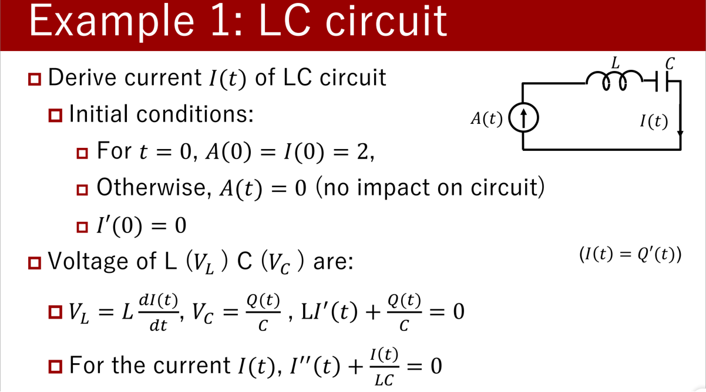
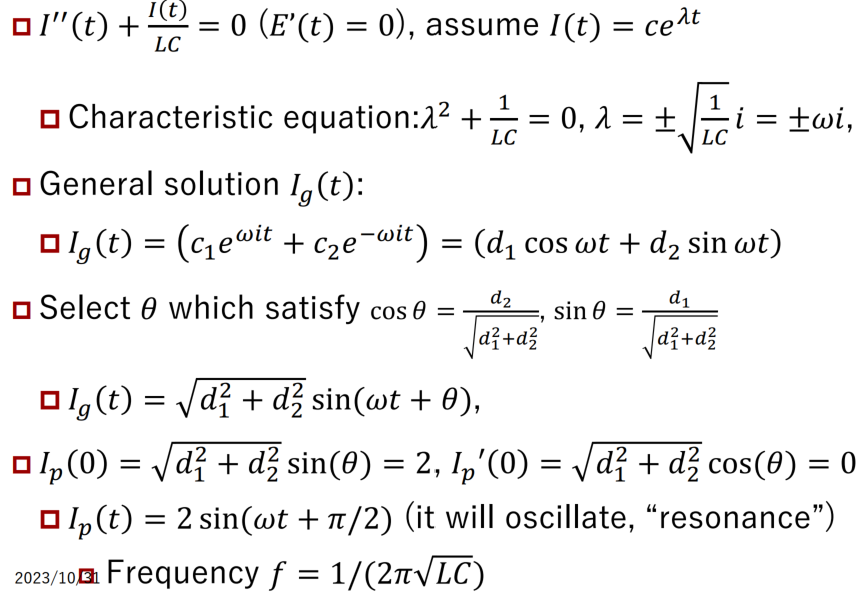
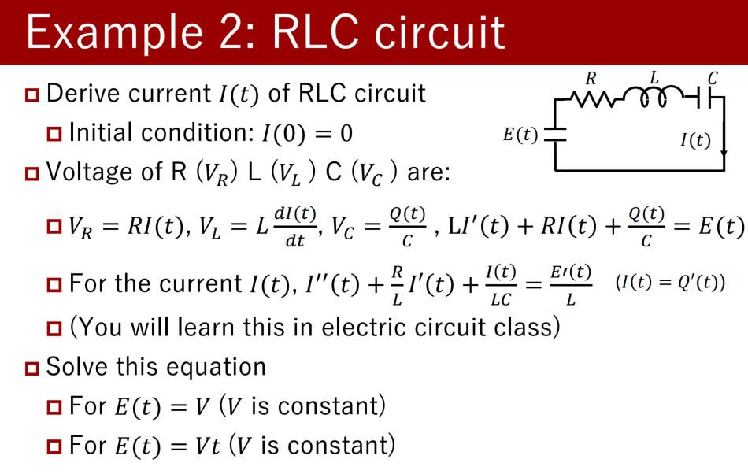
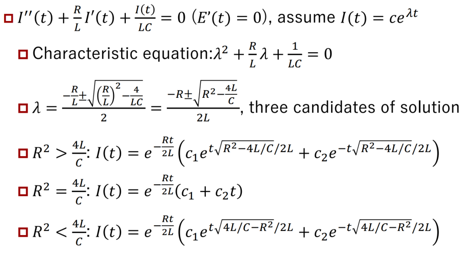
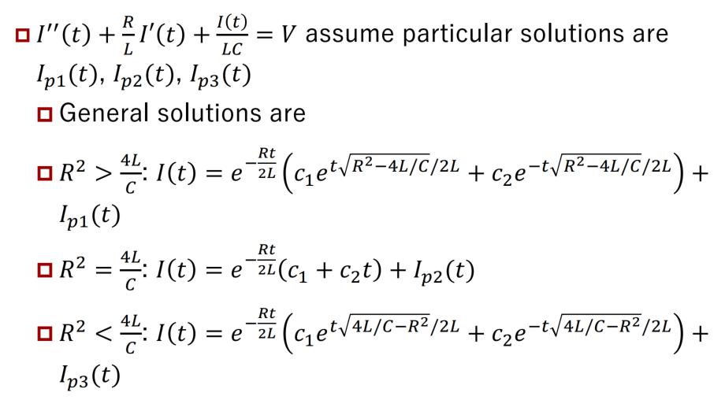

***Exercise***
- $y^{''} + 3y^{'} + 2y = \cos x$
  - $\lambda = -1, -2 \\ y_0 = c_1e^{-x} + c_2e^{-2x}$ (c~1~, c~2~ : constants)
  - asssume particular solution $y_p = \alpha \cos x + \beta \sin x$ (&alpha;, &beta; : constant)
  - $(-\alpha \cos x - \beta \sin x) + 3(-\alpha \sin x + \beta \cos x) + 2(\alpha \cos x + \beta \sin x) = \cos x  $
  - $(-\alpha  +3\beta + 2\alpha)\cos x + (-\beta - 2 \alpha + 2\beta)\sin x = \cos x$
  - $ \alpha = \frac{1}{10}, \beta = \frac{3}{10}$
  - $y_p = \frac{1}{10} \cos x + \frac{3}{10} \sin x $
  - $y = \frac{1}{10} \cos x + \frac{3}{10} \sin x + c_1e^{-x} + c_2e^{-2x}$
- $y^{''} - 2y^{'} + 3y = x^2$
  - $\lambda = 1 \pm \sqrt{2}i $
  - $y_0 = c_1e^{1+\sqrt{2}i} + c_2e^{1 - \sqrt{2}i}$ (c~1~, c~2~: const)
  - Assume particualr solution $y_p = \alpha x^2 + \beta x  + \gamma$ (&alpha;, &beta;, &gamma; : const)
  - $2\alpha - (2\alpha x + \beta) + 3(\alpha x^2 + \beta ) = x^2$
  - $\alpha = \frac{1}{3}, \beta = \frac{4}{9}, \gamma = \frac{2}{27}$
  - $y = y_0 + y_p = c_1e^{1+\sqrt{2}i} + c_2e^{1 - \sqrt{2}i} + \frac{1}{3}x^2 + \frac{4}{9} x + \frac{2}{27}$
- $y^{''} - 2y^{'} - 3y = e^x$
  - $\lambda = -1, 3$
  - $y_0 = c_1 e^{(3x)} + c_2e^{(-x)}$ (c~1~, c~2~: const)
  - Assume particular solution $y_p = Ae^x$ (A: const)
  - $A = -\frac{1}{4}$
  - $y = c_1 e^{(3x)} + c_2e^{(-x)} + -\frac{1}{4}e^x$
- $y^{''} - 2y^{'} - 3y = e^{-x}$
  - $\lambda = -1, 3$
  - $y_0 = c_1 e^{(3x)} + c_2e^{(-x)}$ (c~1~, c~2~: const)
  - Assume particular solution $y_p = Axe^{-x}$ (A: const)
  - $\mathbf{y^{'}_p = A(1-x)e^{-x}}$
  - $\mathbf{y^{''}_p = A(x-2)e^{-x}}$
  - $A = -\frac{1}{4}$
  - $y = y_0 + y_p = c_1 e^{(3x)} + c_2e^{(-x)} -\frac{1}{4}e^{-x} $

***Solve particular solution***
- $y^{''} + 3y^{'} + 2y = \cos x$
  - $\lambda = -1, -2 \\ y_0 = c_1e^{-x} + c_2e^{-2x}$ (c~1~, c~2~ : constants)
  - asssume particular solution $y_p = \alpha \cos x + \beta \sin x$ (&alpha;, &beta; : constant)
  - $(-\alpha \cos x - \beta \sin x) + 3(-\alpha \sin x + \beta \cos x) + 2(\alpha \cos x + \beta \sin x) = \cos x  $
  - $(-\alpha  +3\beta + 2\alpha)\cos x + (-\beta - 2 \alpha + 2\beta)\sin x = \cos x$
  - $ \alpha = \frac{1}{10}, \beta = \frac{3}{10}$
  - $y_p = \frac{1}{10} \cos x + \frac{3}{10} \sin x $
  - $y = \frac{1}{10} \cos x + \frac{3}{10} \sin x + c_1e^{-x} + c_2e^{-2x}$
  - $y^{'}(x) = -c_1e^{-x} - 2c_2e^{-2x}-\frac{1}{10}\sin x + \frac{3}{10}\cos x$
  - $y(\pi) = 0, y^{'}(\pi) = 1$
  - $c_1 = \frac{3}{2}, c_2 =  \frac{3}{2}e^{\pi}$
  - $y(x) = \frac{1}{10} \cos x + \frac{3}{10} \sin x + \frac{3}{2}e^{-x+\pi} + \frac{3}{2}e^{-2(x-\pi)}$

## Array and vector

### Motivation
- div **D** = &rho;
  - $\iint \mathbf{D} \cdot d \mathbf{S} = \iiint \rho dV$ (Gauss’s eq of electricfield)
- div **B** = &rho;
  - $\iint \mathbf{B} \cdot d \mathbf{S} = \iiint div \mathbf{B} dV$ (Gauss’s eq of magneticfield)
  - $rot \mathbf{H} = i + \frac{\delta D}{\delta t} : \oint \mathbf{H} \cdot d\mathbf{r} = \iint(i+\frac{\delta \mathbf{D}}{\delta t})\cdot \mathbf{S}$ `Ampele’s law`
  - $div \mathbf{E} = - \frac{\delta B}{\delta t}: \oint \mathbf{E} \cdot d\mathbf{r} = -\frac{\delta}{\delta t}\iint \mathbf{B}\cdot d \mathbf{S}$ `Faraday’s law`

### Scalar and Vector
- Scalar: Value (only)
- Vector: Value (length) and its direction
- Vector from point 𝑃 to 𝑄 is: $\vec{PQ}$
  - 𝑃: start point, 𝑄: end point
  - if $\vec{P^{'}Q^{'}}$ is equal to $\vec{PQ}$, $\vec{PQ}$ and  $\vec{P^{'}Q^{'}}$ is in the same class
  - If two points are the same, it is zero vector $\vec{PP}, \vec{QQ}$
- To show the vector, we use ****bold and italic****
- Vector: $\textbf{\textit{a}} = \vec{PQ}$
- Zero vector ***0*** = $\vec{PP}$
- 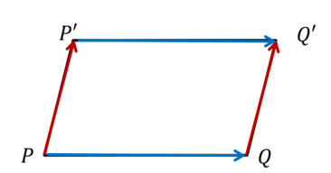

### Add, sub, extension

- Assume $\textbf{\textit{a}} = \vec{OA}, \textbf{\textit{b}} = \vec{OB}, \textbf{\textit{c}} = \vec{OC}$, where O, A, B, C composes parallelogram
  - Define: $-\textbf{\textit{a}} = -\vec{OA} = \vec{AO}$ 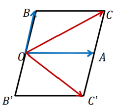
  - Define: $\textbf{\textit{a}} + \textbf{\textit{b}} = \vec{OA} + \vec{OB} = \vec{OC}$
  - Define: $\textbf{\textit{a}} - \textbf{\textit{b}} = \vec{OA} - \vec{OB} = \vec{OC^{'}}$
- For real value &lambda;, its product to the vector ***a*** is
  - ***a***&lambda; = &lambda;***a***
- If the three points 𝑃, 𝑄, 𝑅 are on the same line: $\vec{PQ} = \lambda \vec{PR}$
- If the two vectors are in parallel: ***a***&lambda; = ***b***
  - Geometric vector space
    - Vector space: more general and abstract

### Vector space
- 𝐿 is called vector space if element of 𝐿 satisfy following definition and notation
  - Addition: result of ***a*** + ***b*** is unique (***a***, ***b*** &in; ***L***)
  - Scalar multiply: result of  ***a***&lambda; is unique (***a*** &in; &lambda; &in; R )
- Both satisfy following:
  - Association law: (***a*** + ***b***) + ***c*** = ***a*** + (***b*** + ***c***)
  - Exchange law: ***a*** + ***b*** = ***b*** + ***a***
  - Identity element: ***a*** + ***o*** = ***a***
  - inverse element: ***a*** + ***-a*** = ***o***

### Component

- Vector ***a*** is also defined by its components [a~1~, ..., a~n~]
  - n: its dimension
- For the xyz-coordinate system, ***a*** = [a~x~, a~y~, a~z~]
  - This also satisfy the rules of vector space
- Or, using unit vector ***i***, ***j***, ***k*** for xyz-coord system
  - ***a*** = a~1~***i*** + a~2~***j*** + a~3~***k***, where a~1~ = |a~x~|, a~2~ = |a~y~|, a~3~ = |a~z~|
- Length: |***a***| = $\sqrt{a^{2}_x + a^{2}_y + a^{2}_z}$, unit vector ***u*** = ***a***/|***a***|

### Inner product
- For two vectors $\textbf{\textit{a}} = \vec{OA}, \textbf{\textit{b}} = \vec{OB}, \textbf{\textit{a}} \cdot \textbf{\textit{b}} = c = |\textbf{\textit{a}}||\textbf{\textit{b}}|\cos \theta$ is called as inner product in scaler value $\theta = \angle AOB$
- Inner products has following characteristics
  - $\textbf{\textit{a}} \cdot \textbf{\textit{b}}= \textbf{\textit{b}} \cdot \textbf{\textit{a}}$ 
  - $\textbf{\textit{a}} \cdot (\textbf{\textit{b}} + \textbf{\textit{c}}) = \textbf{\textit{a}} \cdot \textbf{\textit{b}} + \textbf{\textit{a}} \cdot \textbf{\textit{c}}$
  - $\lambda \textbf{\textit{a}} \cdot \textbf{\textit{b}} = \textbf{\textit{a}} \cdot \lambda\textbf{\textit{b}} = \lambda (\textbf{\textit{a}} \cdot \textbf{\textit{b}})$
- For unit vector ***i***, ***j***, ***k***
  - $\textbf{\textit{i}} \cdot \textbf{\textit{i}} = \textbf{\textit{j}} \cdot \textbf{\textit{j}} = \textbf{\textit{k}} \cdot \textbf{\textit{k}} = 1$ 
  - $\textbf{\textit{i}} \cdot \textbf{\textit{j}} = \textbf{\textit{j}} \cdot \textbf{\textit{k}} = \textbf{\textit{k}}\cdot \textbf{\textit{i}} = 0$

### Outer product
- Assume right-hand side coordinate system
- For $\textbf{\textit{a}} = \vec{OA}, \textbf{\textit{b}} = \vec{OB}, \textbf{\textit{c}} = \textbf{\textit{a}} \times \textbf{\textit{b}}$: outer product
  - |***c***| = |***a***||***b***|sin &theta;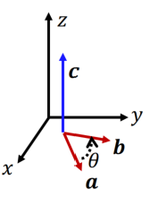
  - Angle of ***c***: perpendicular to the surface of |***a***||***b***|
  - If ***a*** and ***b*** are in parallel (sin &theta; = 0), ***a*** or ***b*** = ***o***, c = ***o***
- Theorem:
  - $\textbf{\textit{a}} \times \textbf{\textit{a}} = \textbf{\textit{o}}$
  - $\textbf{\textit{a}} \times \textbf{\textit{b}} = -\textbf{\textit{b}} \times \textbf{\textit{a}}$
  - $\lambda\textbf{\textit{a}} \times \textbf{\textit{b}} = \textbf{\textit{a}} \times \lambda \textbf{\textit{b}} = \lambda (\textbf{\textit{a}} \times \textbf{\textit{b}})$
  - $\textbf{\textit{i}} \cdot \textbf{\textit{i}} = \textbf{\textit{j}} \cdot \textbf{\textit{j}} = \textbf{\textit{k}} \cdot \textbf{\textit{k}} = ***0***$
  - $\textbf{\textit{i}} \cdot \textbf{\textit{j}} = \textbf{\textit{k}}, \textbf{\textit{j}} \cdot \textbf{\textit{k}} = \textbf{\textit{i}}, \textbf{\textit{k}}\cdot \textbf{\textit{i}} = \textbf{\textit{j}}$ 

**Vector area**
- Vector area: vector combining an area quality w/ dimension
- Assume surface 𝑆 on signed area in two dimension system
  - Vector ***S*** can  be expressed with its unit vector ***n***
    - ***S*** = S ***n***
  - Rotation of vector ***𝒏*** express the sign
    - anticlockwise (right-hand screw) : plus
    - clockwsise (left-hand screw): minus
  - If S is subset of S~i~, the vector area 𝑺 can be
    - $\textbf{\textit{S}} = \sum S_i \textbf{\textit{n}}_i$
    - 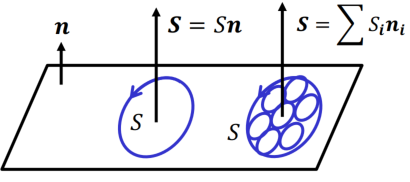

**Projection**
- Area vector is used to calculate surface integral
  - Treat flus of a vector filed through a surface
  - Projection area 𝐴 on plane ***S*** can be calculated by dot product with target plane unit normal ***𝒎***
    - $A = \textit{\textbf{S}} \cdot \textit{\textbf{m}}$
  - If the two surface has same xy and angle 𝜃 for z-coordinate
  - $A = |\textbf{\textit{S}}|\cos \theta$
  - 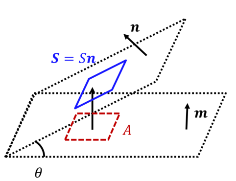

**Volume**
- Volume 𝑉 can be calculated by area vector
  - Calculate volume 𝑉 of tilted cylinder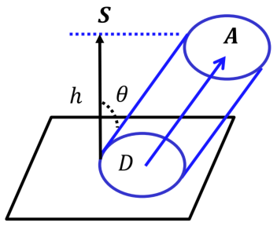
    - Bottom plane: 𝐷
    - Area vector: ***𝑺***
    - Direction: ***𝑨***
    - Assume its angle: 𝜃
  - Hight ℎ = |***𝑨***| cos 𝜃
  - Volume $V = h|\textbf{\textit{S}}| = |\textbf{\textit{A}}||\textbf{\textit{S}}|\cos \theta = |\textbf{\textit{A}}||\textbf{\textit{S}}|$
- Volume $V = |\textbf{\textit{A}}||\textbf{\textit{S}}|$ xpress the amount of flow ***𝑨*** which punctulate the plane 𝐷

## Vector analysis
### Derivation for vector function
- Vector function ***F***(t): vector ***F*** is a function of scalar t
  - if vector ***F*** is continuous to the t: ***F*** is continuous
- Assume vector $\textit{\textbf{F}}(t) = \vec{OP}$, where O is origin(fixed point)
  - Point P draw a curved line
  - 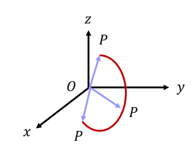

### Characeristics
- A limit: if vector ***A*** satisfy $\lim_{n \to \infty}|\textit{\textbf{A}}_n - \textit{\textbf{A}}| = 0 $ for ***A***~0~ ... ***A***~n~
  - $\lim_{n \to \infty}\textit{\textbf{A}}_n = \textit{\textbf{A}} $, and ***A*** is a limit of ***A***~0~ ... ***A***~n~
- A limit: if vector function ***F***(t) has const. vector ***A***, and it satisfy $\lim_{t \to t_0}|\textit{\textbf{F}}(t) - \textit{\textbf{A}}| = 0 $ for t &rightarrow; t~0~
  - $\lim_{t \to t_0}\textit{\textbf{F}}(t) = \textit{\textbf{A}} $ and ***A*** is a limit of ***F***(t) for t &rightarrow; t~0~
  - For $\textit{\textbf{F}}(t) = F_1(t)\textit{\textbf{i}} + F_2(t)\textit{\textbf{j}} + F_3(t)\textit{\textbf{k}}, \textit{\textbf{A}} = A_1\textit{\textbf{i}} + A_2\textit{\textbf{j}} + A_3\textit{\textbf{k}}$
    - $\lim_{t \to t_0}\textit{\textbf{F}}_1(t) = A_1, \lim_{t \to t_0}\textit{\textbf{F}}_2(t) = A_2, \lim_{t \to t_0}\textit{\textbf{F}}_3(t) = A_3$
- Continuity: if vector function ***F***(t) satisfy $\lim_{t \to t_0}\textit{\textbf{F}}(t) = \textit{\textbf{F}}(t_0) $ for t &rightarrow; t~0~, ***F***(t) is continuous.
- Derivative: if $\lim_{\Delta t \to 0}\frac{\Delta \textbf{\textit{F}}}{\Delta t} = \lim_{\Delta t \to 0}\frac{\Delta \textbf{\textit{F}}(t_0 + \Delta t) - \textbf{\textit{F}}(t_0)}{\Delta t}$ is available, this is called as differential coefficient ***F***^'^(t~0~)
  - For each t, the vector function ***F***^'^(t~0~) or $\frac{d\textbf{\textit{F}}}{dt}$ is called as derivative or derivative vector
  - Similary, derivative can be taken as ***F***^'^(t~0~) and ***F***^(n)^(t~0~)
- Geometric meaning
  - Assume $\vec{OP} = \textbf{\textit{F}}(t),\vec{OQ} = \textbf{\textit{F}}(t + \Delta) $
    - 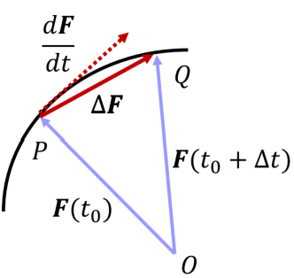
    - $\Delta \textbf{\textit{F}} = \textbf{\textit{F}}(t + \Delta t) - \textbf{\textit{F}}(t) = \vec{PQ}$
    - Take &Delta;t &rightarrow; 0 then &Delta;***F*** becomes tangent

### Theorems for derivation
- Vector function ***F***(t) and ***G***(t), scalar function f(t), satisfy followings
  - (sum) : $\frac{d}{dt}(\textbf{\textit{F}} + \textbf{\textit{G}}) = \frac{d}{dt}\textbf{\textit{F}} + \frac{d}{dt}\textbf{\textit{G}}$
  - (scalar prod): $\frac{d}{dt}(f\textbf{\textit{F}}) = \frac{df}{dt}\textbf{\textit{F}} + f\frac{d}{dt}\textbf{\textit{F}}$
  - (inner prod): $\frac{d}{dt}(\textbf{\textit{F}} \cdot \textbf{\textit{G}}) = \frac{d\textbf{\textit{F}}}{dt} \cdot \textbf{\textit{G}} + \frac{d\textbf{\textit{G}}}{dt} \cdot \textbf{\textit{F}}$
  - (outer prod): $\frac{d}{dt}(\textbf{\textit{F}} \times \textbf{\textit{G}}) = \frac{d\textbf{\textit{F}}}{dt} \times \textbf{\textit{G}} + \frac{d\textbf{\textit{G}}}{dt} \times \textbf{\textit{F}}$
  - For $\textbf{\textit{F}} = F_1\textbf{\textit{i}} + F_2\textbf{\textit{j}} + F_3\textbf{\textit{k}}, \frac{d\textbf{\textit{F}}}{dt} = \frac{dF_1}{dt}\textbf{\textit{i}} + \frac{dF_2}{dt}\textbf{\textit{j}} + \frac{dF_3}{dt}\textbf{\textit{k}}$
  - If ***F*** is constant, $\frac{d\textbf{\textit{F}}}{dt} \text{ is } \textbf{\textit{o}}$, or perpendicular s.t. $\textbf{\textit{F}} \cdot \frac{d\textbf{\textit{F}}}{dt} = 0$
  - 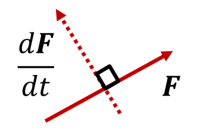

### High order derivatives, partial difference
- High order derivatives can defined as similar to 1st order
  - $\frac{d^2\textbf{\textit{F}}}{dt^2}, \frac{d^3\textbf{\textit{F}}}{dt^3}, \dots \frac{d^n\textbf{\textit{F}}}{dt^n}$
  - For $\textbf{\textit{F}} = F_1\textbf{\textit{i}} + F_2\textbf{\textit{j}} + F_3\textbf{\textit{k}}, \frac{d^n\textbf{\textit{F}}}{dt^n} = \frac{d^nF_1}{dt^n}\textbf{\textit{i}} + \frac{d^nF_2}{dt^n}\textbf{\textit{j}} + \frac{d^nF_3}{dt^n}\textbf{\textit{k}}$
- Partial difference also defined like derivation
  - $\textbf{\textit{A}} = \textbf{\textit{A}}(u, v), \frac{\delta \textbf{\textit{A}}}{\delta u}, \frac{\delta \textbf{\textit{A}}}{\delta v}, \frac{\delta^2 \textbf{\textit{A}}}{\delta v^2}, \frac{\delta^2 \textbf{\textit{A}}}{\delta v \delta u}, \frac{\delta^2 \textbf{\textit{A}}}{\delta u \delta v}, \frac{\delta^2 \textbf{\textit{A}}}{\delta u^2}$
- Total difference of $\textbf{\textit{A}}(u, v) $ can be defined as
  - $\delta\textbf{\textit{A}}(u, v) = \frac{\delta \textbf{\textit{A}}}{\delta v}du + \frac{\delta \textbf{\textit{A}}}{\delta u}dv$
  - It approx. small delta of &delta;***A*** by small delta of du, dv
    - For $\textit{\textbf{A}} = A_1\textit{\textbf{i}} + A_2\textit{\textbf{j}} + A_3\textit{\textbf{k}}, \delta\textit{\textbf{A}} = \delta A_1\textit{\textbf{i}} + \delta A_2\textit{\textbf{j}} + \delta A_3\textit{\textbf{k}}$

### Gradient of scalar
- Scalar function: 𝑓(𝑥, 𝑦, 𝑧) can be defined in unique
  - This field is called scalar field 𝑓
    - Distribution of temperature, mass, voltage
- Vector function: ***𝑭***(𝑥, 𝑦, 𝑧) can be defined in unique
  - This field is called vector field ***𝑭***
    - Electric field, magnetic field, gravity field
- Gradient of scalar: grad $f = \nabla f = \frac{\partial f}{\partial x}\textbf{\textit{i}} + \frac{\partial f}{\partial y}\textbf{\textit{j}} + \frac{\partial f}{\partial z}\textbf{\textit{k}}$
  - &nabla; Hamilton operator
    - &nabla;(f + g) = &nabla;f + &nabla;g, &nabla;&lambda;f = &lambda;&nabla;f, &nabla;(fg) = g&nabla;f + f&nabla;g
    - $\nabla \phi (f) = \frac{d\phi}{df}\nabla f$, where &phi;(f) is a funtion of f

### Equipotential surface
- If group of points 𝑃(𝑥, 𝑦, 𝑧) satisfy 𝑓(𝑥, 𝑦, 𝑧) = 𝑐 (𝑐: const), 𝑃 is called equipotential surface
  - In the case of $f(x, y, z) = x^2 + y^2 + z^2$
    -  Surface of sphere
-  In electro-magnetics, electron (𝑞) create divergence of electric lines (electric field: 𝐸), and electric line create equipotential voltage (𝑉)
   -  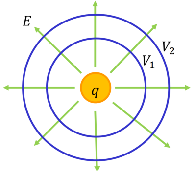

### Divergence of vector
- For vector $\textbf{\textit{F}}(x, y, z) = F_1(x,y,z)\textbf{\textit{i}} + F_2(x,y,z)\textbf{\textit{j}} + F_3(x,y,z)\textbf{\textit{k}}$
  - div $\textbf{\textit{F}} = \frac{\partial F_1}{\partial x} + \frac{\partial F_2}{\partial y} + \frac{\partial F_3}{\partial z} = \nabla \cdot \textbf{\textit{F}}$ is called as divergence
- Vector ***F***, ***G*** scalar f satisfy following conditions
    - div(***F*** + ***G***) = div(***F***) + div(***G***)
    - div(f***G***) = grad(f) $ \cdot $ ***G*** + f div***G***
    - $\text{div grad}(f) = \frac{\partial^2 f}{\partial x^2} + \frac{\partial^2 f}{\partial y^2} + \frac{\partial^2 f}{\partial z^2}$
- Physical meaning
  - div***F*** > 0 : something spout (flow out)
  - div***F*** < 0 : something swallowed (flow in)
- div $\textbf{\textit{F}} = \frac{\partial F_1}{\partial x} + \frac{\partial F_2}{\partial y} + \frac{\partial F_3}{\partial z} = \nabla \cdot \textbf{\textit{F}}$
- Assume flow ***𝑭*** of small box 𝑑𝑥𝑑𝑦𝑑𝑧
  - Assume flow ***𝑭*** of area 𝑑***𝑺***~1~ = (−𝑑𝑦𝑑𝑧, 0,0) at 𝑥 − $\frac{𝑑𝑥}{2}$
  - Assume flow ***𝑭*** of area 𝑑***𝑺***~2~ = (+𝑑𝑦𝑑𝑧, 0,0) at 𝑥 + $\frac{𝑑𝑥}{2}$
    - $\textbf{\textit{F}} \cdot d \textbf{\textit{S}} = \textbf{\textit{F}} \cdot d \textbf{\textit{S}}_2 + \textbf{\textit{F}} \cdot d \textbf{\textit{S}}_1$
    - = $F_1(x+\frac{dx}{2}, y, z)(dydz,0,0) + F_1(x-\frac{dx}{2}, y, z)(-dydz,0,0)$
    - = $\frac{\partial F_1}{\partial x}dxdydz$
    - 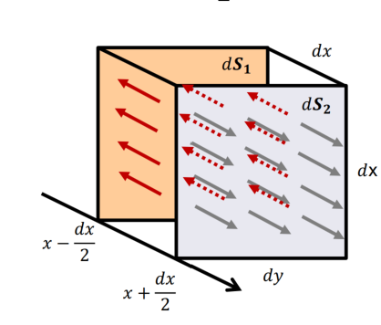
    - Diff. flow in (the red arrow) and out (the gray arrow)

### Rotation of vector
- For vector $\textbf{\textit{F}}(x, y, z) = F_1(x,y,z)\textbf{\textit{i}} + F_2(x,y,z)\textbf{\textit{j}} + F_3(x,y,z)\textbf{\textit{k}}, \text{rot}\textbf{\textit{F}} = (\frac{\partial F_3}{\partial y} - \frac{\partial F_2}{\partial z})\textbf{\textit{i}} + (\frac{\partial F_1}{\partial z} - \frac{\partial F_3}{\partial x})\textbf{\textit{j}} + (\frac{\partial F_2}{\partial x} - \frac{\partial F_1}{\partial y})\textbf{\textit{k}} = \nabla \times \textbf{\textit{F}}$ is called as rotation
- rot ***F*** = (rot~1~ ***F***)***i*** + (rot~2~ ***F***)***j*** + (rot~3~ ***F***)***k***
- Vector ***F***, ***G***, scalar f satisfy following conditions
  - rot(***F*** + ***G***) = rot(***F***) + rot(***G***)
  - rot(f***G***) = grad(f)&times;G + f&nabla;&times;G
- Physical meaning
  - rot ***𝑭*** > 0: right-hand side (screw) rotation 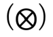
  - rot ***𝑭*** < 0: left-hand side (screw) rotation 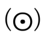

### Physical meaning of rotation
- Focus 3rd term (𝒌) of rotation
  - If $\frac{\partial F_2}{\partial x} > 0$, it generates right-hand side rotation
  - If $-\frac{\partial F_1}{\partial y} > 0$, it generates right-hand side rotation
  - If $(\frac{\partial F_2}{\partial x} - \frac{\partial F_1}{\partial y})\textbf{\textit{k}} > 0$ means right-hand side rotation is available

### Examples
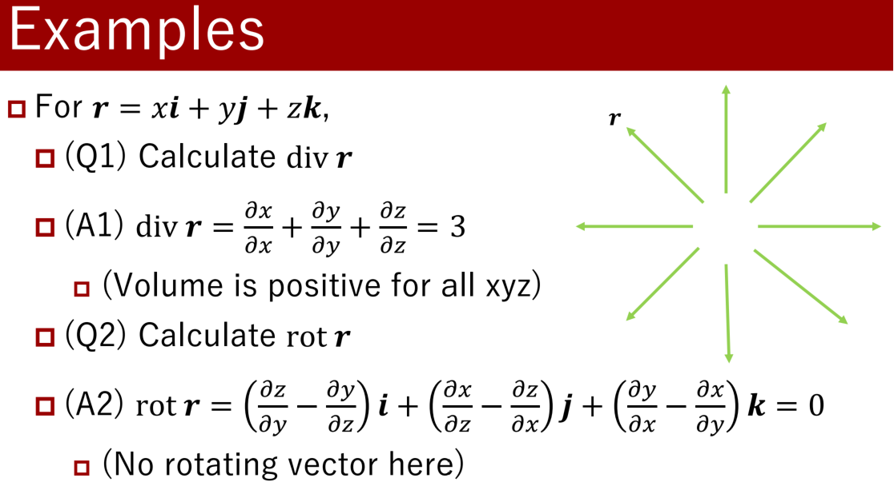
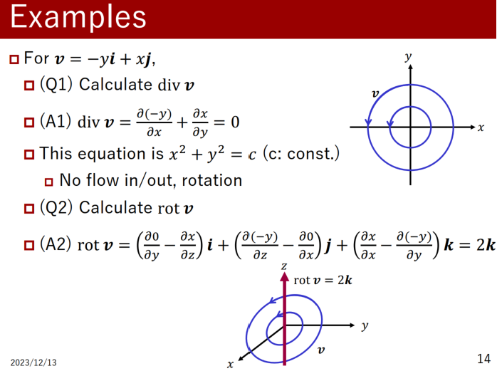

### Exercise
- Assume **a**, **b** is constant vector, |**r**(t)| = r(t), calculate its derivation
  - $r\textbf{r} + (\textbf{a} \cdot \textbf{r})\textbf{b}$
    - $(r\textbf{r} + (\textbf{a} \cdot \textbf{r})b)^{'}$
    - $= r^{'}\textbf{r} + r\textbf{r}^{'} + (\textbf{a} \cdot \textbf{r}^{'})\textbf{b}$
  - $\frac{\textbf{r}}{r^2}$
    - $ = \frac{\textbf{r}^{'}}{r^2} - \frac{\textbf{r}}{r^3}$
- Calculate gradient for following functions
  - $f = xz^3 - x^2y$, calculate &nabla;f at point P(1,-2,2)
    - $ \nabla f = \frac{\partial f}{\partial x}\textbf{i} + \frac{\partial f}{\partial y}\textbf{j} + \frac{\partial f}{\partial z}\textbf{k}$
    - $ = (z^3 - 2xy)\textbf{i} + (-x^2)\textbf{j} + (3xz^2)\textbf{k}$
    - $= (8+4)\textbf{i} + (-1)\textbf{j} + 12\textbf{k} = 12\textbf{i} -1\textbf{j} + 12\textbf{k}$
  - $f = x^2y^2 - 2xz^3$, calculate &nabla;f at point P(1,-2,1)
    - $\nabla f = (2xy^2 - 2z^3)\textbf{i} + (2x^2y)\textbf{j} + (-6xz^2)\textbf{k}$
    - $6\textbf{i} - 4\textbf{j} - 6\textbf{k}$
- Calculate divergence of following functions
  - $x^2y\textbf{i} - 2y^2z^2\textbf{j} + 3z^3x^3\textbf{k}$
    - $div \textbf{F} = \frac{\partial F_1}{\partial x} + \frac{\partial F_2}{\partial y} + \frac{\partial F_3}{\partial z}$
    - $= 2xy - 4yz^2 + 9z^2x^3$
- Calculate rotation of following functions
  - $x^2\textbf{i} - 2xz\textbf{j} + y^2z\textbf{k}$
  - rot(f) = $(\frac{\partial f_3}{\partial y} - \frac{\partial f_2}{\partial z})\textbf{i} + (\frac{\partial f_1}{\partial z} - \frac{\partial f_3}{\partial x})\textbf{j} + (\frac{\partial f_2}{\partial x} - \frac{\partial f_1}{\partial y})\textbf{k}$ 
  - $= (2yz - (-2x))\textbf{i} + (0 - 0)\textbf{j} + ((-2z) - 0)\textbf{k}$
  - $= 2(yz+x)\textbf{i} - 2z\textbf{k}$

### Integral of Vector
***Curvilinear Vector***
- Assume a smooth curve C from point A to B, and scalar function f(P) = f(x, y, z) is continuous in curve C
  -  Think curve C can divide into several arcs &Delta;s~1~ ... &Delta;s~2~
     -  Points A~n~ divide a curve, these weight are points P~n~
     -  Assume limit of n &rightarrow; &infin;, &Delta;s~i~ &rightarrow; 0; **curvilinear inntegral**
     -  $\lim_{{n \to \infin}, {\Delta s_i \to 0}}\sum_{i=1}^{n}f(P_i)\Delta s_i = \int _C f(P)ds = \int _C f(x, y, z)ds$
  -  Point D on curve C is function of the length (s) of arc arc(AD)
  -  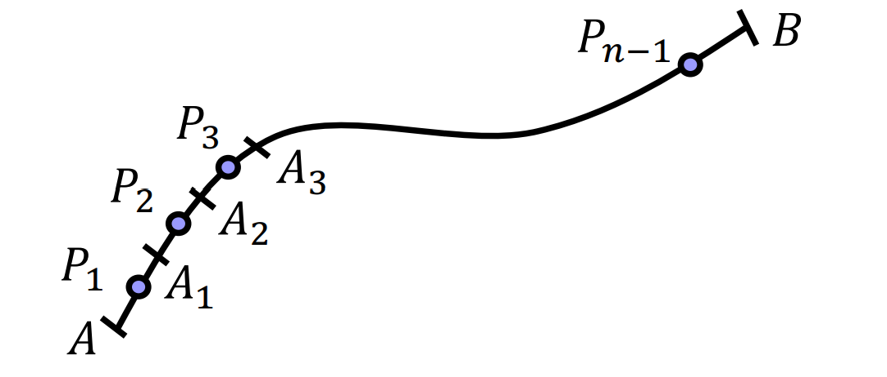
-  Point D on curve C is function of the length(s) of arc$\hat{AD}$
   -  (Any) point D can be expressed as function of length s
      -  $\textbf{r} = \textbf{r}(s) = x(s)\textbf{i} + y(s)\textbf{j} + z(s)\textbf{k}$
      -  $\int_{C}f(x,y,z)ds = \int^{B}_{A}f(x(s),y(s),z(s))ds$
-   If we use general parameter 𝑡 to express the curve 𝐶;
    -   $\textbf{r} = \textbf{r}(t) = x(t)\textbf{i} + y(t)\textbf{j} + z(t)\textbf{k}$
    -   $ds = \sqrt{(\frac{dx}{dt})^2 + (\frac{dy}{dt})^2 + (\frac{dz}{dt})^2}dt$
    -   $\int_{C}f(x,y,z)ds = \int^{\beta}_{\alpha}f(x(s),y(s),z(s))\sqrt{(\frac{dx}{dt}^2 + \frac{dy}{dt}^2 + \frac{dz}{dt}^2)}dt$
        -  where A, B of curve C are point &alpha; = t &beta; = t

### Experssions of curvilinear integral
- Several expressions are available for curvilinear integral
  - $\int_C f ds = \int^{B}_{A}f ds = \int_{AB} f ds$
  - $\int_{AB} f ds = - \int_{BA} f ds$
- If point P is on the curve 𝐶, $\int_{AB} fds = \int_{AP} fds + \int_{PB} fds$
- If the curve C is a closed curve, $\oint_C fds = \oint_{AB} fds$

### Example of curvilinear integral
- Calculate curvilinear integral of f(x, y, z) = $y^2z + z^2x + x^2y$
  - Route 1: O(0, 0, 0) &rightarrow; Q(3, 0, 0) &rightarrow; R(3, 1, 0) &rightarrow; P(3, 1, 2)
    - $\int_{R1}fds = \int^{Q}_{O}f ds + \int^{R}_{Q}f ds + \int^{P}_{R}f ds$
    - $= \int^3_0 f(x, 0, 0)dx + \int^1_0 f(3, y, 0)dy + f^2_0 f(3, 1, z)dz \\ = \frac{65}{2}$
  - Route 2: $\vec{OP}$
    - $\vec{OP} = \textbf{r} = 3t\textbf{i} + t\textbf{j} + 2t\textbf{k} (0 \leq t \leq 1)$
    - $ds = \sqrt{(sdt)^2 + (1dt)^2 + (2dt)^2} = \sqrt{14}dt$
    - $\int_{R2} fds = \int^{\sqrt{14}}_{0}(y^2z+z^2x+x^2y)ds \\ = \int^1_0(2t^3 + 12t^3 + 9t^3)\sqrt{3^2 + 1^2 + 2^2}dt = \frac{23\sqrt{14}}{4}$
  
### Curvilinear integral for vector
- Assume a smooth curve C from point A to B, and vector function **F**(P) = **F**(x, y, z) is continuous in curve C
  - **r**(s) is a position vector from origin O to the point P on C
  - Assume **t** $= \frac{d\textbf{r}}{ds}$ is a tangent of curve C at point P
    - Curvilinear integral for the vector **F**: $\int_C \textbf{F}\cdot \textbf{t}ds$ 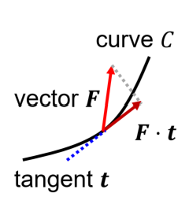
    - Assume function of C: **r**(s) = x(s)**i** + y(s)**j** + z(s)**k**, **F** = F~1~**i** + F~2~**j** + F~3~**k**
      - $\int_C \textbf{F}\cdot\textbf{t}ds = \int_C (\frac{F_1dx}{ds} + \frac{F_1dy}{ds} + \frac{F_1dz}{ds})$
    - Scalar $\textbf{F}\cdot\textbf{t}$ is a tangent component of the vector **F**

### Characteristics of curvilinear integral for vector
-  Curvilinear integral for vector has following characteristics
   -  For scalar field 𝑓(𝑥, 𝑦, 𝑧) and vector field **F**(𝑥, 𝑦, 𝑧)
      -  $\int_C f(x, y, z)d\textbf{r} = \textbf{i}\int_C fdx + \textbf{j}\int_C fdy + \textbf{k}\int_C fdz$
      -  $\int_C \textbf{F}(x, y, z)d\textbf{r} = \textbf{i}\int_C \textbf{F}_1dx + \textbf{j} \int_C \textbf{F}_2dy + \textbf{k}\int_C \textbf{F}_3dz$
      -  $\int_C \textbf{F}\times d\textbf{r} = \int_C \textbf{F}\times \textbf{r}ds = \textbf{i}\int_C (F_2dz - F_3dy) + \textbf{j}\int_C (F_3dz - F_1dy) + \textbf{k}\int_C (F_1dz - F_2dy)$

### Exercise
- Calculate curvilinear integral $\int_C y d \textbf{r}$
  - C: x = a cos(t), y = a sin(t), z = ht, (0 &leq; t &leq; 2&pi;)
- Solution
  - $\int_C yd\textbf{r} = \int_C a \sin t (\textbf{i}dx + \textbf{j}dy + \textbf{k}dz) \\ -\textbf{i}\int^{2\pi}_{0}a^2 \sin^2tdt + \textbf{j}\int^{2\pi}_{0}a^2 \sin t \cos tdt + \textbf{k}\int^{2\pi}_{0}ah \sin tdt \\ = -\pi a^2 \textbf{i}$

### Potential 
- If scalar function &phi;(x, y, z) is aviable for **F**(x, y, z) = grad&phi; ; &phi; is called as potential or scalar potential of **F**
- Potential has following characteristics:
  - Assume vector field **F**(x, y, z) has potential &phi;
    - $\int^B_A \textbf{F}\cdot d\textbf{r} = -\int^B_A \nabla \varphi \cdot d \textbf{r} = \varphi (A) - \varphi(B)$
  -  If curve C is a closed curve
     -  $\oint _C F \cdot d\textbf{r} = -\oint _C \nabla \varphi \cdot d \textbf{r} = 0$

### Surface integral for scalar
- Assume smooth curved surface 𝑆
  - Scalar function 𝑓(𝑃) = 𝑓(𝑥, 𝑦, 𝑧) is continuous in 𝑆
    - Assume 𝑆 can be divided into small area $\Delta S_1 \dots \Delta S_n$, and any point of $P_1 \dots P_n$
    - If $\lim\limits_{{n \rightarrow \infin},{\Delta S_i \rightarrow 0}} \sum^n_{i = 1}f(P_i)\Delta S_i$ is available, this is called surface integral for scalar $\int_S f(x, y, z)dS$
  - If f(P) = 1, $\int_S f(x, y, z)dS$  is area of S.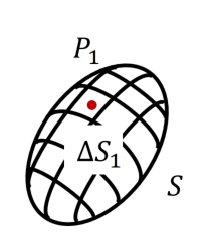
- for the curved surface, outside is the front.

### Formula of surface integral
- If surface S is given for z = g(x, y), surface integral of f(x, y, z) on S can be expressed as follows,
  - $\int_S f(x, y, z)dS = \iint_D f(x, y, g(x, y))\sqrt{p^2 + q^2 +1}dxdy$
  - $= \iint_D f(x, y, g(x, y)) \frac{dxdy}{|\textbf{n}\cdot\textbf{k}|}$ 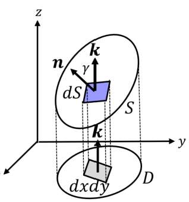
    - where, $p = \frac{\partial z}{\partial x}, q = \frac{\partial z}{\partial y}, \textbf{n}$ is unit normal vector of 𝑆, 𝐷 is projective of 𝑆 to 𝑥𝑦-coordinate

#### Proof
- Think small surface 𝑑𝑆 on 𝑆, its projective in 𝑥𝑦-coordinate can express 𝑑𝑦𝑑𝑥
- Define angle of unit normal vectors **𝒏**, **𝒌** as 𝛾
  - dS|cos &lambda;| = dxdy
- $\textbf{n} = \frac{\pm 1}{\sqrt{p^2 + q^2 + 1}}$ when $p = \frac{\partial z}{\partial x}, q = \frac{\partial z}{\partial y} $
- Thus, |cos &gamma;| = |**n**$\cdot$**k**| = $\frac{1}{\sqrt{p^2 + q^2 + 1}}$
- $dS = \frac{dxdy}{|\cos \gamma|} = \frac{dxdy}{|\textbf{n}\cdot \textbf{k}|}$
- $\int_S f(x, y, z)dS = \iint_D f(x, y, g(x, y)) \frac{dxdy}{|\textbf{n}\cdot\textbf{k}|} $ (z = g(x, y))

### Surface integral for vector

- For vector field **𝑭** and unit vector 𝒏 of surface **𝑆**integral of these inner products is called as surface integral of vector
  - $\int_S \textbf{F}\cdot \textbf{n}dS$
  - F~n~ is a **n** component of vector **F**($\textbf{F}\cdot\textbf{n} = F_n$)
  - Assume $\textbf{n}dS = d\textbf{S}, d\textbf{S} is called area vector$
    - $\int_S \textbf{F}\cdot\textbf{n} dS  = \int_S F_n dS = \int_S \textbf{F} \cdot d \textbf{S} = \oint \textbf{F}\cdot\textbf{n} dS$ (If 𝑆 is closed surface)
    - For $\textbf{F} = F_1\textbf{i} + F_2\textbf{j} + F_3\textbf{k}$
      - $\int \textbf{F}\cdot\textbf{n} dS = \iint_S (F_1dydz + F_2dzdx + F_3dxdy)$
  - Several expressions for surface integral of vectors
    - $\int \textbf{F}dS = \textbf{i}\int_S F_1dS + \textbf{j}\int_S F_2dS + \textbf{k}\int_S F_3dS$
    - $\int_S \textbf{F}\times\textbf{b}dS = \int_S \textbf{F}\times d\textbf{S}$

### Formula of surface integral
- If surface 𝑆 is given for 𝑧 = 𝑔(𝑥, 𝑦), surface integral of **𝑭**(𝑥, 𝑦, 𝑧) on 𝑆 can be expressed as follows,
  - $\int_S \textbf{F}(x, y, z)dS = \iint_D \textbf{F}(x, y, g(x,y))\sqrt{p^2 + q^2 +1}dxdy$
    - where, $p = \frac{\partial z}{\partial x}, q = \frac{\partial z}{\partial y}$, D is projective of 𝑆 to 𝑥𝑦-coordinate

### Surface integral in physics
- In scalar: $\int_S \rho(x,y,z)dS$
  - In the case &rho; is a function of mass density on surface 𝑆
    - Its integral: total mass of surface 𝑆
- In vector: $\int_S \textbf{v}(x,y,z)\cdot dS$
  - In the case **v** is a function of liquid velocity on surface S
    - Its integral: total amount of liquid flow per unit time
    - 

### Volume integral
- Connect divergence on vector field and flow at the surface
  - Assume volume 𝑉 surrounded by surface 𝑆
    - Volume integral of scalar f: $\int_V f(x,y,z)dV$
    - Volume integral of vector **F**: $\int_V \textbf{F}(x,y,z)dV$
      - $\int_V \textbf{F}(x, y, z)dV = \textbf{i}\int_V F_1dV + \textbf{j}\int_V F_2 dV + \textbf{k}\int_V F_3 dV$
- Preliminary
  - For volume V surrounded by surface S, **n** = &cos; &alpha;**i** + &cos;**j** + &cos;**k**, folowing equation satisfies,
  - $\int_V \frac{\partial f}{\partial x}dV = \int_S f\cos \alpha dS \\ \int_V \frac{\partial f}{\partial y}dV = \int_S f\cos \beta dS \\ \int_V \frac{\partial f}{\partial z}dV = \int_S f \cos \gamma dS$

### Proof
- Proof $\int_V \frac{\partial f}{\partial z}dV = \int_S f \cos \gamma dS$
- Assume two points P~1~, P~2~ on S
  - z~2~ &ge; z~1~: z~2~ coves upper side of S, z~1~ coves lower side if S
  - $\int_V \frac{\partial f}{\partial z}dV means volume difference in z-axis, thus$ 
- $\int_V \frac{\partial f}{\partial z}dV = \iiint_V \frac{\partial f}{\partial z}dxdydz = \iint_D{\int^{z_2}_{z_1} \frac{\partial f}{\partial z}dz}dxdy \\ =\iint_D [f]^{z_2}_{z_1} dxdy = \iint_D {f(x,y,z_2) - f(x,y,z_1)}dxdy$

- For z-axis, z~2~ is upper ($dS \cos \gamma = dxdy$), z~1~ is lower thus ($dS \cos \gamma = -dxdy$)
  - $\iint_D f(x,y,z_2)dxdy = \int_{S_2} f(x,y,z)dS$
  - $\iint_D f(x,y,z_1)dxdy = -\int_{S_1} f(x,y,z)dS$
  - $\int_V \frac{\partial f}{\partial z}dV = \int_{S_2}f\cos \gamma dS + \int_{S_1}f\cos \gamma dS \\ = \int_{S}f\cos \gamma dS$

### Divergence theorem(Dauss' theorem)
- Connect divergence on vector field and flow at the surface  
  - Assume volume V surrounded bt surface S w/unit vector
    - $\int_V div \textbf{F}dV = \int_V \nabla \cdot \textbf{F}dV = \int_S \textbf{F}\cdot\textbf{n}dS$ 
  - Physical meaning
    - $\int_S \textbf{F}\cdot \textbf{n}: amount of flow which path through the area S$
    - $\int_V div \textbf{F}dV: amount of flow out$
    - 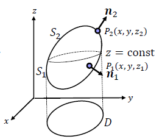
### Extension of Gauss' theorem
- Assume the point 𝑃 on close surface 𝑆 , express vector from origin 𝑂(0, 0, 0) to P as $\stackrel{\rightarrow}{P} = \textbf{r},\textbf{n}$ is unit normal vector of S
- Following equation satisfy the following
  - $\int_S \frac{\textbf{r}}{r^3}\cdot \textbf{n}dS = \left\{\begin{aligned} & 0\text{(when O is outside of S)}\\ & 2\pi \text{(when O is on the surface S)}\\ &  4\pi \text{(when O is inside of S)}\end{aligned}\right.$
  - 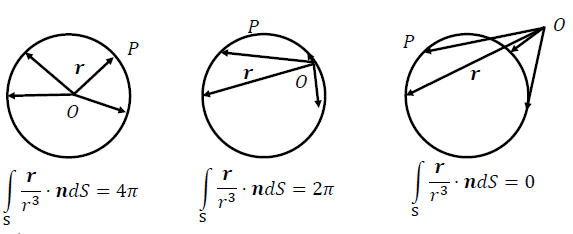

### Exercise 
- For function $f(x,y,z) = x^2 - yz + z^2$, calculate its curvilinear integral $\int_C f ds$
  - Case 1: C is a line from P~1~(1,2,0) to P~2~(1,2,3)
    - $\int_C fds = \int^3_0(1^2 - 2z + z^2)dz = {[z-z^2 + \frac{z^3}{3}]}^3_0 = 3$
  - Case 2: C is a line

