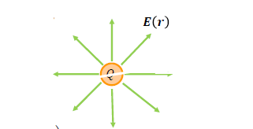
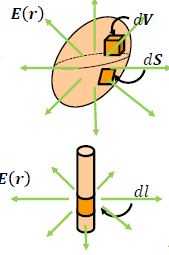
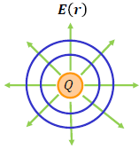
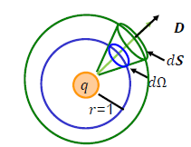
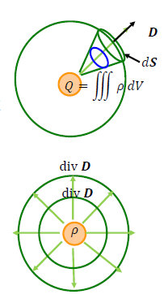
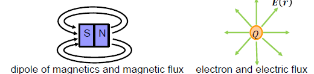

# Fundamental Mathematics - Vector Analysis Application

##Motivation
- Many physics can be expressed by vectors
  - Good to explain in simple way (if we know vectors)
- Target: understand the meaning of Maxwell’s equation
  - div **D** = &rho;
    - $\iint \textbf{D} \cdot d\textbf{S} = \iiint \rho dV$ `(Gauss's equation of electric-field)`
  - div **B** = 0
    - $\iint \textbf{B} \cdot d\textbf{S} = \iiint div \textbf{B} dV$ `(Gauss's equation of magnetic-field)`
  - rot **H** = $i + \frac{\delta B}{\delta t}: \oint \textbf{H}\cdot d\textbf{r} = \iint(i + \frac{\delta \textbf{D}}{\delta t})\cdot d\textbf{S}$ `Ampele's law`
  - rot **E** = $-\frac{\delta B}{\delta t}:\oint \textbf{E}\cdot d\textbf{r} = -\frac{\delta}{\delta t}\iint \textbf{B}\cdot d\textbf{S}$ `Faraday's law`

## Electron and Electric field
- Two electron q~1~, q~2~ with distance r have attracting/repulsion force F. 
  - Coulomb's law $F = \frac{1}{4\pi \epsilon}\frac{q_1q_2}{r^2}$
    - $\epsilon = \epsilon_0 \epsilon_r$
    - &epsilon; is dielectric constant`(permittivity)`
    - &epsilon;~0~ is vacuum space permittivity $= 8.854 \times 10^{-12} C^2N^{-1}m^{-2}$
    - &epsilon;~r~ is relative permittivity
  - Electron 𝑄 create vector field $\textbf{E(r)} = \frac{1}{4\pi \epsilon} \frac{Q}{r^2}\frac{\textbf{r}}{r}$
    - Coulomb's law in vector $\textbf{F} = \frac{1}{4\pi\epsilon}\frac{qQ}{r^2}\frac{\textbf{r}}{r} = q\textbf{E(r)}$

- Electric field follows superposition law
  - For electron q~j~ for vector r~j~ (j = 1, ..., N)
    - $\textbf{E(r)} = \frac{1}{4\pi\epsilon}\int^N_{j=1}\frac{\textbf{r} - \textbf{r}_j}{|\textbf{r}-\textbf{r}_j|^3}$
  - For continuous distribution of electron $\rho d\textbf{V}$, where $\rho_s$: electron density
    - For volume $d\textbf{V}:\textbf{E(r)} = \frac{1}{4\pi\epsilon}\iiint\frac{\rho_s\textbf{(r-s)}}{|\textbf{(r-s)}|^3}d\textbf{V}$
    - For surface $d\textbf{S}:\textbf{E(r)} = \frac{1}{4\pi\epsilon}\iiint\frac{\rho_s\textbf{(r-s)}}{|\textbf{(r-s)}|^3}d\textbf{S}$
    - For line $dl:\textbf{E(r)} = \frac{1}{4\pi\epsilon}\iiint\frac{\eta_s\textbf{(r-s)}}{|\textbf{r-s}|^3}dl$
## Electric flux
- Assume electron generate line of divergence
  - Electric flux (similar: electric line)
  - Electron 𝑄 generate 𝑄 lines of electric flus
  - Density **D** should be change by the position
    - **D** = &epsilon;**E**
  - Assume area vector **S** with its unit normal vector **n**
    - **S** = **n**S
  - Amount of electric flux penetrate area S
    - $\phi = \textbf{D}\cdot \textbf{S}$
  - For small area d**S** 
    - $d\phi = \textbf{D}\cdot d\textbf{S}, \phi = \iint d\phi = \iint \textbf{D}\cdot d\textbf{S}$

## Gauss’s law for electric field
- Relationship between electric flux 𝑑𝜙 generated by electron 𝑞 , and its penetrating area 𝑑 **S** on any shape
  - $d\phi = \textbf{D}\cdot d\textbf{S}$
- For the sphere w/ diameter of one, electric flux ratio should
  - $$q\frac{d\Omega}{4\pi} = \begin{equation}\left\{\begin{aligned}& \textbf{D}\cdot d\textbf{S} (\textbf{r}\cdot d\textbf{S}>0) \\ & \textbf{-D}\cdot d\textbf{S} (\textbf{r}\cdot d\textbf{S}<0)\end{aligned}\right.\end{equation}$$
- If $\textbf{r}\cdot d\textbf{S} > 0$`curve is convex`
  - $\phi = \iint \textbf{D}\cdot \textbf{S}  = \iint q\frac{d\Omega}{4\pi}=q$
  - For volume w/electron desity &rho;
    - $\iint \textbf{D}\cdot d\textbf{S} = \iiint \rho dV$
## Physical meaning of Gauss’s law for electric field
- $\int \textbf{D}\cdot d\textbf{S} = \iiint \rho dV$ `integral from` 
  - $\iiint \rho dV$: Total amount of electrons inside the volume
  - $\int \textbf{D}\cdot d\textbf{S}$ : Total amount of electric flux flow-outs from the surface
- div $\textbf{D} = \rho$ `differential form`
  - div $\textbf{D}$ : divergence electric flux `density`
  - &rho; : electron `density`

## Magnetics and magnetic field
- Two amount of magnetics q~m1~, q~m2~ with distance r have attracting/repulsion force F
  - Coulomb’s law for magnetics $F = \frac{1}{4\pi\mu}\frac{q_{m1}q_{m2}}{r^2}$
    - &mu; = &mu;~0~&mu;~r~
    - &mu; is magnetic permeability (permeability)
    - mu;~0~ is permeability in vacuum $(= 4\pi \times 10^{-7} H/m)$
    - &mu;~r~ is relative permeability
- Monopole Q~m~ create magnetic field $\textbf{H(r)} = \frac{1}{4\pi \epsilon} \frac{Q_m}{r^2}\frac{\textbf{r}}{r}$
  - Coulomb’s law in vector $\textbf{F} = \frac{1}{4\pi \epsilon}\frac{q_mQ_m}{r^2}\frac{\textbf{r}}{r} = q_m\textbf{H(r)}$

## Gauss’s law for magnetic field
- Magnetic pole of 𝑞~𝑚~ generates 𝑞~𝑚~ lines of magnetic flux
  - Magnetic flux density $\textbf{B}$ create magnetic field $\textbf{H}$
    - $\textbf{B} = \mu \textbf{H}$
- Magnetic should in dipole (set of S and N, no monopole)
  - Same amount of flux from N to S
    - $\iint \textbf{B}\cdot d\textbf{S} = \iiint div\textbf{B }dV = 0$`interal form`
    - div **B** = 0 `differential form`
- Gauss’s law for magnetic field
  - No divergence in magnetic field (no monopole)
  - 

