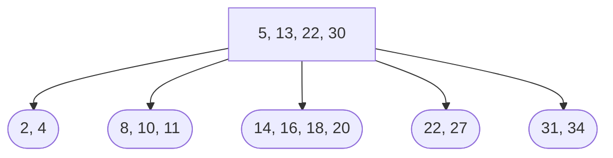

# Database Final Report

XIONG ZHIPENG  
SID: 44231536

## Question 1
**Consider the B+ Tree below. The degree of the B+ tree is two.**
Root nodes: [5, 13, 22, 30]
Leaf nodes:[2, 4], [8, 10, 11], [14, 16, 18, 20], [22, 27], [31, 34]

1. **Show the B+ tree after inserting data entries with keys 15, 17, 12, following this order.**

- Firstly, insert the data entry with key 15.
  - Root nodes: [5, 13, 22, 30]
  - Leaf nodes:[2, 4], [8, 10, 11], [14, 15, 16, 18, 20], [22, 27], [31, 34]
  - However, the leaf node [14, 15, 16, 18, 20] overflows. Split the leaf node, add the 16 into the root.

- - The root node becomes [5,13,16,22,30], which exceeds the maximum number of keys for a node. So split the root node [5,13,16,22,30]. Split into two nodes: [5, 13] and [22, 30] and Create a new root node with the median 16.

- - Final B+ Tree Structure
    - After inserting key 15 and adjusting the tree, the structure is as follows:
    1. New Root Node: [16]
    2. Subtrees:
       - Left subtree: [5, 13]
         - Leaf nodes: [2, 4], [8, 10, 11], [14, 15]
       - Right subtree: [22, 30]
         - Leaf nodes: [18, 20], [22, 27], [31, 34]

- - Secondly, insert 17 into the B+ Tree.

- - Finally, insert 12 into the B+ Tree.

2. **Show the B+ tree after deleting the data entries with keys 22, 34, 27, following this order, from the above original tree**

Root nodes: [5, 13, 22, 30]
Leaf nodes:[2, 4], [8, 10, 11], [14, 16, 18, 20], [22, 27], [31, 34]

- Firstly, delete 22. The B+ tree becomes Root nodes: [5, 13, 22, 30]
Leaf nodes:[2, 4], [8, 10, 11], [14, 16, 18, 20], [27], [31, 34]. A leaf node must contain at least 2 keys. Since [27] has only 1 key, it is underflowed.

Root node: [5, 13, 18, 30]
Leaf nodes: [2, 4], [8, 10, 11], [14, 16], [20, 27], [31, 34]
- Secondly, delete 34. Need re-distribution.

- Finally, delete 27.

Root node: [5, 13, 18]
Leaf node: [2, 4], [8, 10, 11], [14, 16], [20, 30 , 31]

## Question 2
**Suppose that relation R has the following schema:**

- &sigma;~sid=1234~(R)
  - (a) Clustered B+-index on sid
    - sid = 1234 means r = 1
    - Estimated Cost: 4 pages
  - (b) Clustered Hash Index on sid
    - Estimated Cost: 2.2 pages
  - (c) Heap File
    -  A heap file requires scanning all 1,000 pages to find the tuple with sid = 1234.
   - (d) Unclustered B+-index on age
    -  Estimated Cost: 3 pages
**Best Method is (b) Clustered Hash Index on sid**

- &sigma;~age=24~(R) Here, assume that R has 100 tuples satisfying age = 24.
  - Clustered B+-index on sid
    - With a clustered index, similar sid values are grouped together, so r would be proportional to the number of pages required to store these 100 tuples. Given that each page holds 10 tuples, 100 tuples would require $\frac{100}{10} = 10$ pages
    - Estimated Cost: 13 pages
  - Clustered Hash Index on sid
    - Estimated Cost: 11.2 pages
  - Heap File
    - Cost: Worst-case is scanning all pages.
    - Explanation: To find all tuples with age = 24, might need to scan the entire file.
    - To find 100 tuples, may need to scan around 10 pages on average, assuming tuples are randomly distributed.
    - Estimated Cost: Approximately 10 pages (though could be slightly higher if tuples are not evenly distributed)
  - Unclustered B+-index on age
    - Estimated Cost: 12 pages
  - **Best Access Method: (c)Heap File**
-  &sigma;~sid>5000^age<50~(R) Here, assume that R has  6,000 tuples satisfying age < 50
   -  Clustered B+-index on sid
      -  We need to estimate r pages. Since sid is clustered and records are stored in sorted order, retrieving records with sid > 5000 would mean accessing a contiguous set of pages starting from sid = 5001. Thus, roughly 3,000 tuples are in this subset. If each page contains 10 tuples, then retrieving 3,000 tuples would require approximately 300 pages.
      -  Estimated Cost: 303 pages
   -  Clustered Hash Index on sid
      -  Estimated Cost: 301.2 pages
   -  Heap File
      -  Estimated Cost: 600 pages
   -  Unclustered B+-index on age
      -  Estimated Cost: 302 pages
   -  **Best Access Method: (b) Clustered Hash Index on sid**
-  Maximum value of age, **Best Access Method: (d) Unclustered B+-index on age**

## Question 3
1. Explain Strict 2PL. Here, show an example of the protocol, by inserting s(∙) (shared lock) and x(∙) (exclusive lock), to S1. Assume that all the locks obtained by a transaction is unlocked when the transaction commits or aborts.

 **(S1) T1:R(X), T2:R(X), T1:W(X), T3:R(Y), T2:W(X), T2: Commit, T3: W(X), T1:Commit, T3:Commit**

- **Strict Two-Phase Locking (Strict 2PL)** is a concurrency control protocol used in database systems to ensure serializability. It involves two phases for each transaction:
  - **Growing Phase:** A transaction may obtain locks (shared or exclusive), but may not release any locks.
  - **Shrinking Phase:** A transaction releases its locks and cannot obtain any new locks.
- In Strict 2PL, a transaction holds all its exclusive locks until it commits or aborts. This ensures that no other transaction can read or write an item that another transaction is writing until the first transaction completes, thus preventing cascading aborts.
- Applying Strict 2PL to Schedule S1
>  - T1: s(X), R(X), x(X), W(X)
>  - T2: s(X), R(X) (waits for T1 to commit)
>  - T1: Commit
>  - T2: x(X), W(X)
>  - T2: Commit
>  - T3: s(Y), R(Y), x(X) (waits for T2 to commit)
>  - T2: Commit
>  - T3: x(X), W(X)
>  - T3: Commit

1. Reading uncommitted data by a transaction can enhance concurrency, but such uncommitted data can be undone when a failure happens. Describe a protocol that allows reading uncommitted data, but guarantees that each committed transaction’s writes will
become permanent (not undone) and part of a consistent database state. Also argue whether your protocol causes cascading aborts or not.
- **Optimistic Concurrency Control (OCC)** is a protocol that allows transactions to read uncommitted data but ensures that writes of committed transactions become permanent and are part of a consistent database state. This protocol operates in three phases:
  - **Read Phase:** Transactions read and perform computations on data items without acquiring locks.
  - **Validation Phase:** Before committing, a transaction validates whether it conflicts with other transactions. If there are conflicts, the transaction is aborted and restarted.
  - **Write Phase:** If validation is successful, the transaction writes its changes to the database.

- **OCC can cause cascading aborts**. For example, if T2 writes X and T3 reads this uncommitted write, and T2 is later aborted during the validation phase, then T3 must also be aborted because it has read uncommitted data.

3. Show a schedule that is view-serializable, but not conflict-serializable using S1. 
- T1: R(X), T2: R(X), T2: W(X), T3: R(Y), T1: W(X), T3: W(X)

1. **Initial Reads**:
   - **T1** reads `X` (R(X)).
   - **T2** reads `X` (R(X)).

2. **Writes**:
   - **T2** writes `X` (W(X)).
   - **T1** writes `X` (W(X)).
   - **T3** reads `Y` (R(Y)).
   - **T3** writes `X` (W(X)).

**View Serializability**

To determine if the schedule is view-serializable, we need to verify the three conditions.

1. **Initial Reads**:
   - **T1** reads the initial value of `X`.
   - **T2** reads the initial value of `X`.

2. **Reads From**:
   - **T1** reads the initial value of `X`.
   - **T2** reads the initial value of `X`.
   - **T3** reads the initial value of `Y`.

3. **Final Writes**:
   - The final write to `X` is by **T3**.
   - The final write to `Y` is not mentioned, so it remains consistent.

The schedule can be viewed as equivalent to the serial schedule \( T1 \rightarrow T2 \rightarrow T3 \) since all the initial reads, reads from, and final writes match.

**Conflict Serializability**

To determine if the schedule is conflict-serializable, we construct the precedence (conflict) graph:

1. **T1** reads `X` before **T2** writes `X` (`T1 → T2`).
2. **T2** writes `X` before **T1** writes `X` (`T2 → T1`).
3. **T3** writes `X` after **T2** writes `X` (`T2 → T3`).
4. **T3** writes `X` after **T1** writes `X` (`T1 → T3`).

From this, we get the following directed precedence graph:

- **T1** → **T2**
- **T2** → **T1**
- **T2** → **T3**
- **T1** → **T3**

The graph contains a cycle (`T1 → T2 → T1`), indicating that the schedule is **not conflict-serializable**.

Thus, This is an example of a schedule that is view-serializable but not conflict-serializable.

