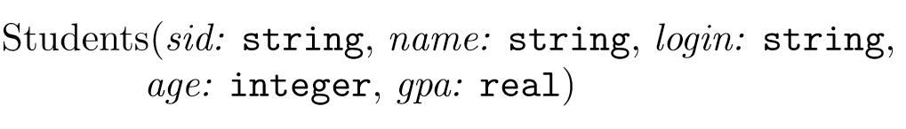

# CH1 

- [CH1](#ch1)
  - [What is a DBMS, in particular, a relational DBMS?](#what-is-a-dbms-in-particular-a-relational-dbms)
  - [Why should we consider a DBMS to manage data?](#why-should-we-consider-a-dbms-to-manage-data)
  - [How is application data represented in a DBMS?](#how-is-application-data-represented-in-a-dbms)
  - [Why study Databases?](#why-study-databases)
  - [How is data in a DBMS retrieved and manipulated?](#how-is-data-in-a-dbms-retrieved-and-manipulated)
  - [How does a DBMS support concurrent access and protect data during system failures?](#how-does-a-dbms-support-concurrent-access-and-protect-data-during-system-failures)
  - [What are the main components of a DBMS?](#what-are-the-main-components-of-a-dbms)
  - [Who is involved with databases in real life?](#who-is-involved-with-databases-in-real-life)

## What is a DBMS, in particular, a relational DBMS?

<dl>
    <dt>Database</dt>
    <dd>a collection of data, typically describing the activities of one or more related organizations.</dd>
</dl>

For example, a university database might contain information about the following:

- **Entities** such as students, faculty, courses, and classrooms.
- **Relationships** between entities, such as students’ enrollment in courses, faculty teaching courses, and the use of rooms for courses.

<dl>
    <dt>Database management system, DBMS</dt>
    <dd>a software designed to assist in maintaining and utilizing large collections of data</dd>
</dl>

## Why should we consider a DBMS to manage data?

!

## How is application data represented in a DBMS?

## Why study Databases?

## How is data in a DBMS retrieved and manipulated?

<dl>
  <dt>data model</dt>
  <dd>a collection of high-level data description constructs that hide many low-level storage details</dd>
  <dt>schema</dt>
  <dd>A description of data in terms of a data model</dd>
</dl>

In the relational model, the schema for a relation specifies its name, the name of each **field** (or **attribute** or **column**), and the type of each field.

As an example, student information in a university database may be stored in a relation with the following schema:

The preceding schema says that each record in the Students relation has five fields, with field names and types as indicated. An example instance of the Students relation appears in Figure 1.1.

Every row follows the schema of the Students relation. The schema can therefore be regarded as a template for describing a student.

<dl>
  <dt>integrity constraints</dt>
  <dl>conditions that the records in a relation must satisfy.</dl>
</dl>

<dl>
  <dt>data definition language</dt>
  <dd>is used to define the external(view) and conceptual schemas</dd>
</dl>

<dl>
<dt>physical schema</dt>
<dd>specifies additional storage details.</dd>
</dl>

Essentially, the physical schema summarizes how the relations described in the conceptual schema are actually stored on secondary storage devices such as disks and tapes.

<dl>
<dt>External schemas</dt>
<dd>which usually are also in terms of the data model of the DBMS, allow data access to be customized (and authorized) at the level of individual users or groups of users.</dd>
</dl>

## How does a DBMS support concurrent access and protect data during system failures?

<dl>
<dt>Data independence</dt>
<dd>application programs are insulated from changes in the way the data is structured and stored</dd>
</dl>

## What are the main components of a DBMS?

## Who is involved with databases in real life?

