

# CH2: The Entity-Relationship Model

- [CH2: The Entity-Relationship Model](#ch2-the-entity-relationship-model)
  - [What are the steps in designing a database?](#what-are-the-steps-in-designing-a-database)
  - [Why is the ER model used to create an initial design?](#why-is-the-er-model-used-to-create-an-initial-design)
  - [What are the main concepts in the ER model?](#what-are-the-main-concepts-in-the-er-model)
  - [What are guidelines for using the ER model effectively?](#what-are-guidelines-for-using-the-er-model-effectively)
  - [How does database design fit within the overall design framework for complex software within large enterprises?](#how-does-database-design-fit-within-the-overall-design-framework-for-complex-software-within-large-enterprises)
  - [What is UML and how is it related to the ER model?](#what-is-uml-and-how-is-it-related-to-the-er-model)
  - [CASE STUDY: THE INTERNET SHOP](#case-study-the-internet-shop)
    - [Requirements Analysis](#requirements-analysis)
    - [Conceptual Design](#conceptual-design)

## What are the steps in designing a database?

The database design process can be divided into six steps. The ER model is most relevant to the first three steps.

1. ***Requirements Analysis:*** The very first step in designing a database application is to understand what data is to be stored in the database, what applications must be built on top of it, and what operations are most frequent and subject to performance requirements.
2. ***Conceptual Database Design:*** The information gathered in the requirements analysis step is used to develop a high-level description of the data to be stored in the database, along with the constraints known to hold over this data.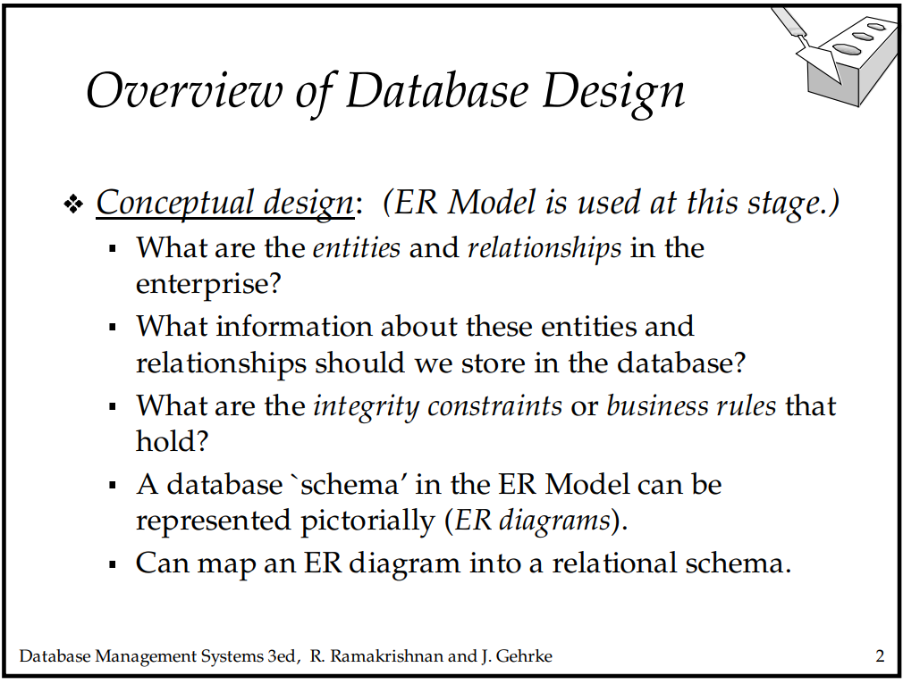
3. ***Logical Database Design:*** We must choose a DBMS to implement our database design, and convert the conceptual database design into a database schema in the data model of the chosen DBMS. We will consider only relational DBMSs, and therefore, the task in the logical design step is to convert an ER schema into a relational database schema.
4. **Schema Refinement:** The fourth step in database design is to analyze the collection of relations in our relational database schema to identify potential problems, and to refine it.
5. **Physical Database Design:** In this step, we consider typical expected workloads that our database must support and further refine the database design to ensure that it meets desired performance criteria.
6. **Application and Security Design:** Any software project that involves a DBMS must consider aspects of the application that go beyond the database itself.

## Why is the ER model used to create an initial design?

## What are the main concepts in the ER model?

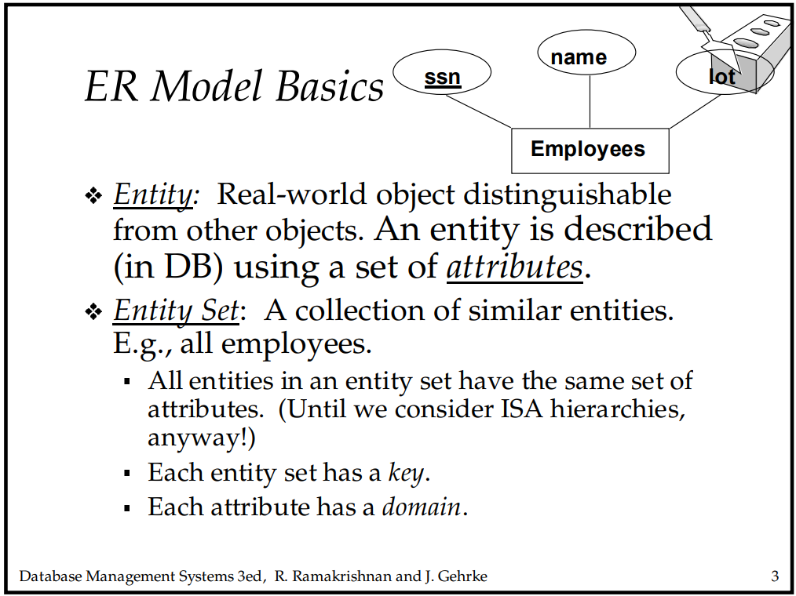

<dl>
    <dt>key</dt>
    <dd>a minimal set of attributes whose values uniquely identify an entity in the set</dd>
</dl>

There could be more than one **candidate key**; if so, we designate one of them as the **primary key**.

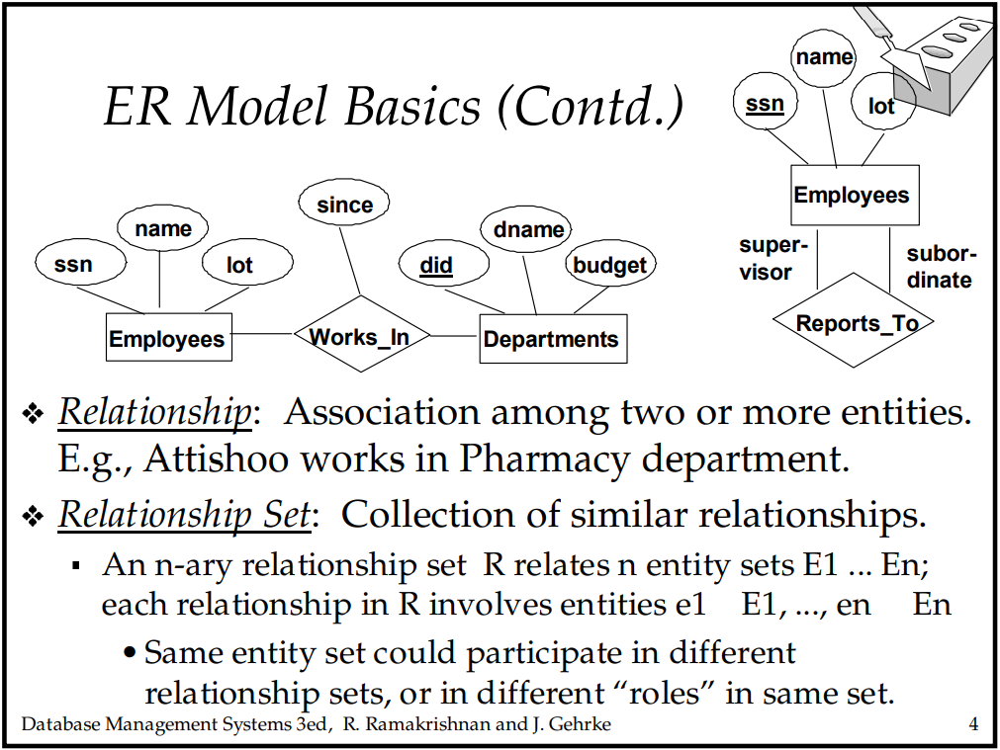

**descriptive attributes:** used to record information about the relationship, rather than about any one of the participating entities

## What are guidelines for using the ER model effectively?
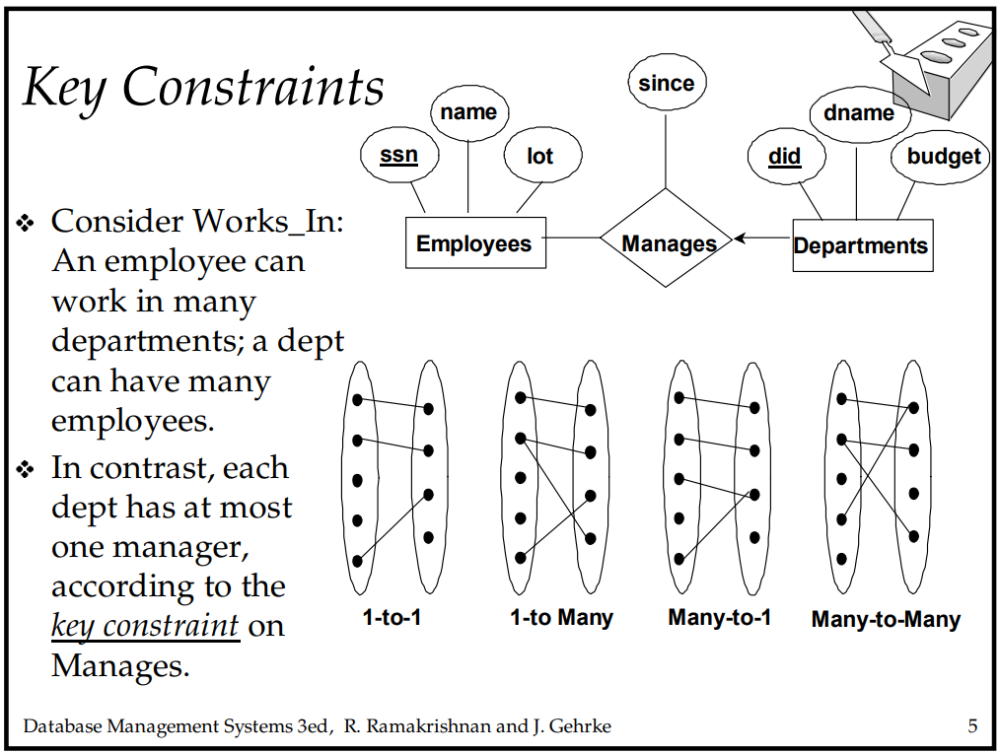
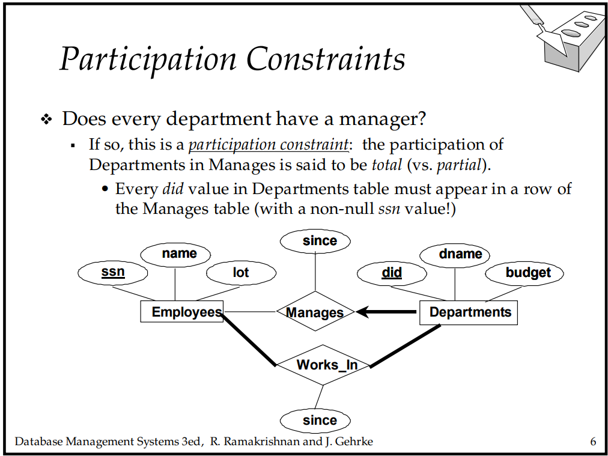
If the participation of an entity set in a relationship set is total, the two are connected by a thick line; independently, the presence of an arrow indicates a key constraint.
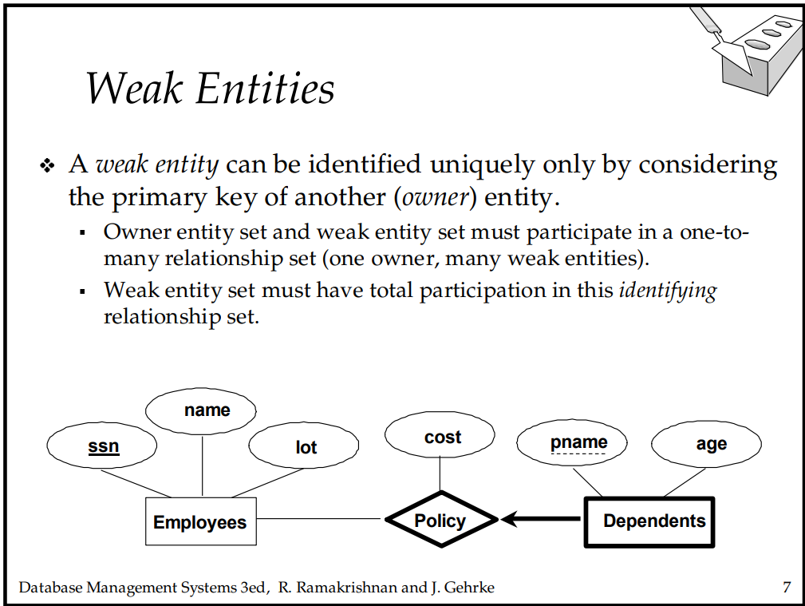

- **identifying relationship set:** The owner entity set and the weak entity set must participate in a one-to-many relationship set.
- The weak entity set must have total participation in the identifying relationship set.

## How does database design fit within the overall design framework for complex software within large enterprises?

We say that the attributes for the entity set Employees are inherited by the entity set Hourly Emps and that Hourly Emps ISA (read is a) Employees.

- Employees is **specialized** into subclasses. Specialization is the process of identifying subsets of an entity set (the **superclass**) that share some distinguishing characteristic.
- Hourly Emps and Contract Emps are **generalized** by Employees.

- **Overlap constraints** determine whether two subclasses are allowed to contain the same entity. For example, can Attishoo be both an Hourly Emps entity and a Contract Emps entity? Intuitively, **no**. Can he be both a Contract Emps entity and a Senior Emps entity? Intuitively, **yes**. We denote this by writing ‘**Contract Emps OVERLAPS Senior Emps.**’
- **Covering constraints** determine whether the entities in the subclasses collectively include all entities in the superclass.For example, does every Employees entity have to belong to one of its subclasses? Intuitively, no. Does every Motor Vehicles entity have to be either a Motorboats entity or a Cars entity? Intuitively, yes. A characteristic property of generalization hierarchies is that every instance of a superclass is an instance of a subclass. We denote this by writing ‘**Motorboats AND Cars COVER Motor Vehicles.**’

There are two basic reasons for identifying subclasses (by specialization or generalization):
1. We might want to add descriptive attributes that make sense only for the entities in a subclass. For example, hourly wages does not make sense for a Contract Emps entity, whose pay is determined by an individual contract.
2. We might want to identify the set of entities that participate in some relationship. For example, we might wish to define the Manages relationship so that the participating entity sets are Senior Emps and Departments, to ensure that only senior employees can be managers. As another example, Motorboats and Cars may have different descriptive attributes (say, tonnage and number of doors), but as Motor Vehicles entities, they must be licensed. The licensing information can be captured by a Licensed To relationship between Motor Vehicles and an entity set called Owners.

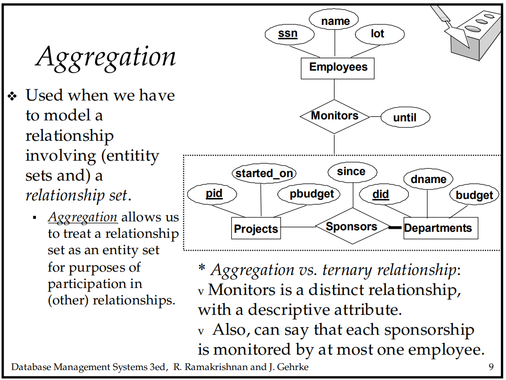

Suppose that we have an entity set called Projects and that each Projects entity is sponsored by one or more departments. The Sponsors relationship set captures this information. A department that sponsors a project might assign employees to monitor the sponsorship. Intuitively, Monitors should be a relationship set that associates a Sponsors relationship (rather than a Projects or Departments entity) with an Employees entity. However, we have defined relationships to associate two or more entities.

To define a relationship set such as Monitors, we introduce a new feature of the ER model, called aggregation.

<dl>
    <dt>Aggregation</dt>
    <dd>allows us to indicate that a relationship set (identified through a dashed box) participates in another relationship set.</dd>
</dl>

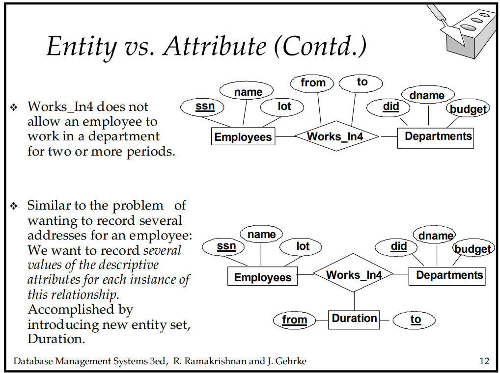
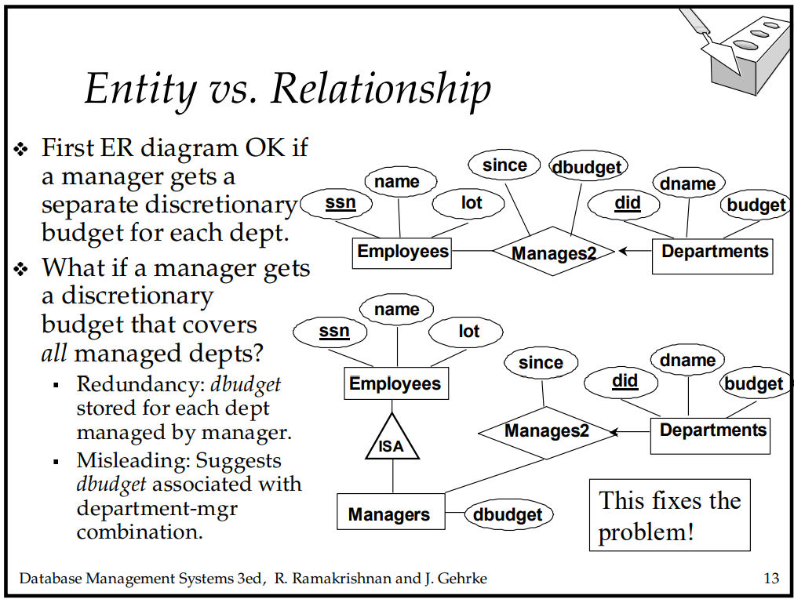
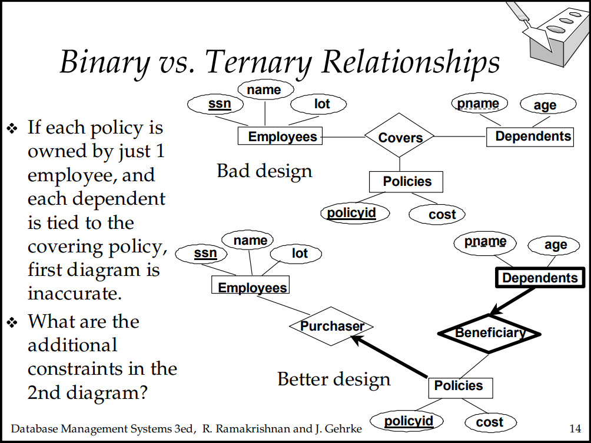
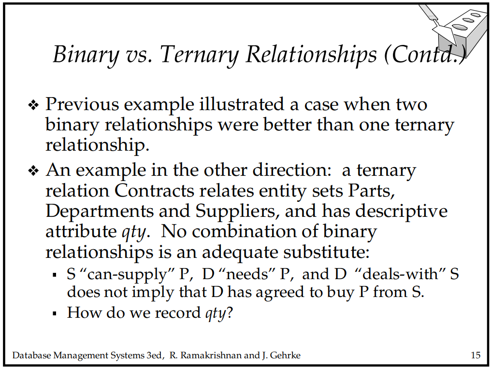

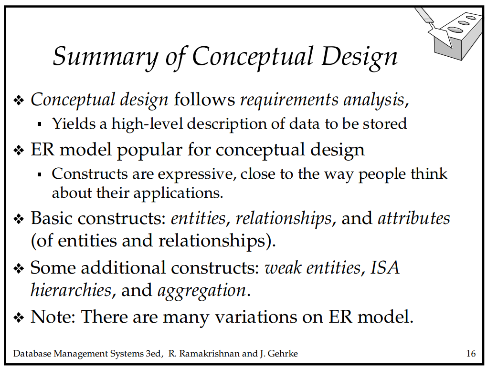
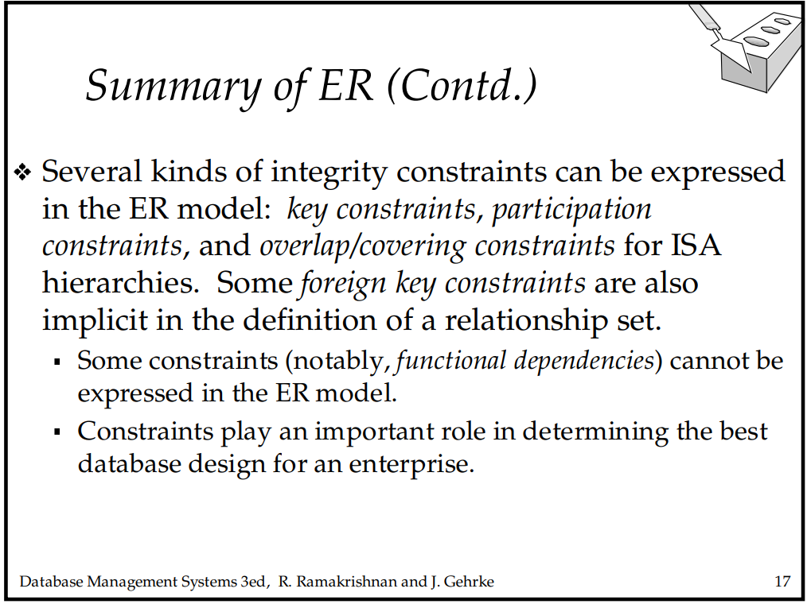
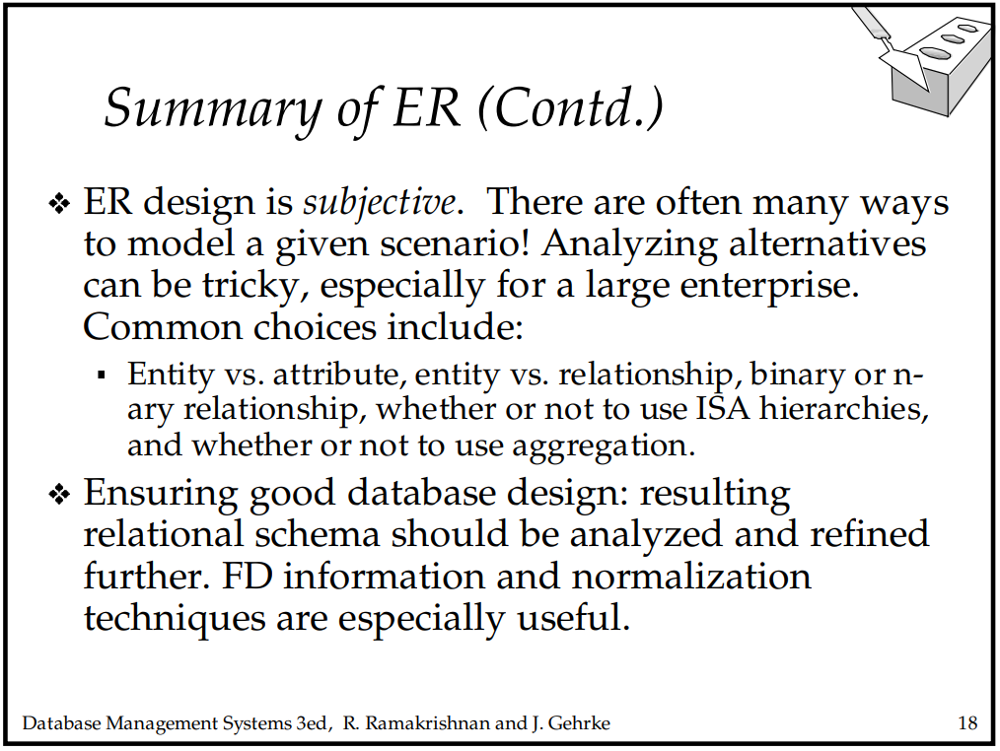

## What is UML and how is it related to the ER model?

<dl>
    <dt>unified modeling language (UML) approach</dt>
    <dd>like the ER model, has the attractive feature that its constructs can be drawn as diagrams. It encompasses a broader spectrum of the software design process than the ER model</dd>
</dl>

## CASE STUDY: THE INTERNET SHOP

B&N is a large bookstore specializing in books on horse racing, and it has decided to go online. DBDudes first verifies that B&N is willing and able to pay its steep fees and then schedules a lunch meeting—billed to B&N, naturally—to do requirements analysis.

### Requirements Analysis

“I would like my customers to be able to browse my catalog of books and place orders over the Internet. Currently, I take orders over the phone. I have mostly corporate customers who call me and give me the ISBN number of a book and a quantity; they often pay by credit card. I then prepare a shipment that contains the books they ordered. If I don’t have enough copies in stock, I order additional copies and delay the shipment until the new copies arrive; I want to ship a customer’s entire order together. My catalog includes all the books I sell. For each book, the catalog contains its ISBN number, title, author, purchase price, sales price, and the year the book was published. Most of my customers are regulars, and I have records with their names and addresses.

New customers have to call me first and establish an account before they can use my website.

On my new website, customers should first identify themselves by their unique customer identification number. Then they should be able to browse my catalog and to place orders online.”

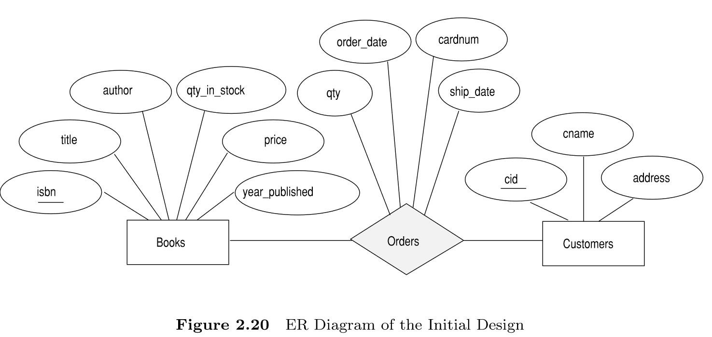

### Conceptual Design

Books and customers are modeled as entities and related through orders that customers place. Orders is a relationship set connecting the Books and Customers entity sets. For each order, the following attributes are stored: quantity, order date, and ship date. As soon as an order is shipped, the ship date is set; until then the ship date is set to null, indicating that this order has not been shipped yet.

