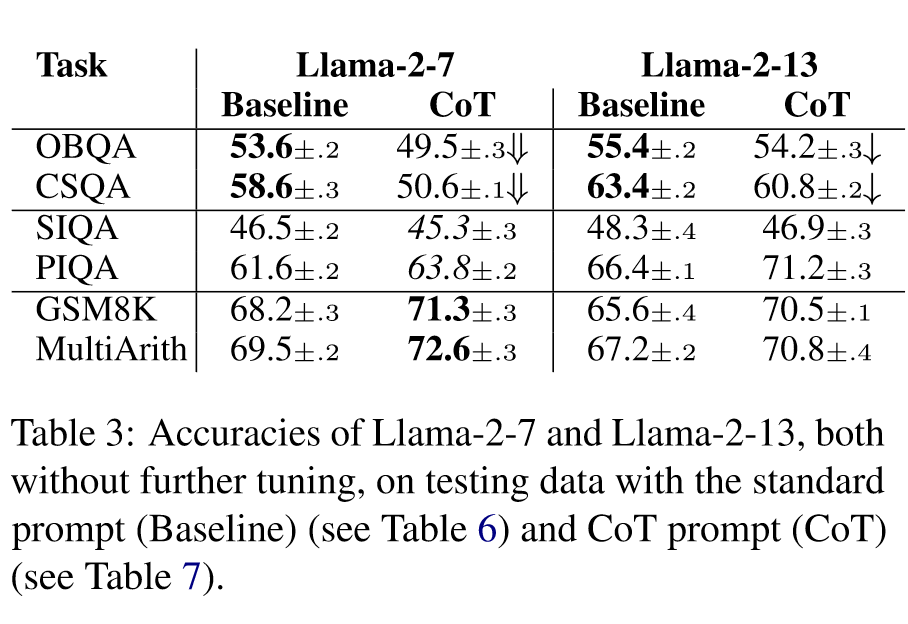

# Aligning Large and Small Language Models via Chain-of-Thought Reasoning

**Leonardo Ranaldi, André Freitas**  
Idiap Research Institute, Switzerland 
Department of Computer Science, University of Manchester, UK
[firstname].[lastname]@idiap.ch

> - [Abstract](#abstract)
> - [Introduction](#introduction)
> - [Related Work](#related-work)
> - [Method](#method)
> - [Experiment](#experiment)
> - [Results](#results)
> - [Conclusion](#conclusion)

## Abstract

**Challenge&Motivation**

1. **Although Chain-of-Thought (CoT)** prompting empowers the reasoning abilities of Large Language Models (LLMs), eliciting them to solve complex reasoning tasks in a step-wise manner, these abilities appear only in models with billions of parameters. 
2. Many companies are releasing LLMs of the same family with fewer parameters, but these models tend not to preserve all the reasoning capabilities of the original models, including CoT reasoning.

**Achievement**

<dl>
  <dt>Instruction-tuning-CoT method</dt>
  <dd>a method for aligning and transferring reasoning abilities between larger to smaller Language Models</dd>

</dl>

**How**
an Instruction-tuning designed around CoT Demonstrations

**Evaluation**
instruct a smaller Language Model using outputs generated by more robust models belonging to the same family or not, evaluating the impact across different types of models

**Results**

Results obtained on question-answering and mathematical reasoning benchmarks show that LMs instructed via the Instruction-tuning CoT method produced by LLMs outperform baselines within both in-domain and out-domain scenarios.

## Introduction

Chain-of-Thought (CoT) prompting elicits Large Language Models (LLMs) to break down a reasoning task towards a sequence of intermediate steps.

The CoT prompting mechanism only proved to be consistently operational for models at a certain scale (e.g., with more than 60B parameters(Wei et al., 2023))

This paper's **contribution**:

1. a method to enable CoT reasoning over SLMs (named student models) by performing Instruction-tuning via demonstrations delivered by LLMs (teacher models)
2. the concept of in-family alignment for teacher-student Instruction-tuning
   1. investigate the induction and alignment of Chainof-Thought reasoning abilities through the support of CoT-Demonstrations "taught" by LLMs teachers to SLMs students (see Figure 1), contrasting between in-family and out-family settings.
   2. Complementing the foundation work of (Magister et al., 2023; Shridhar et al., 2023) we introduce the Instruction-tuning CoT approach (i.e., a taskoriented specialization of Supervised Fine-Tuning) through which we instruct student models with CoT-Demonstrations produced by in-family and out-family teachers

**The target research questions**
- **RQ1.** How does Instruction-tuning via Demonstrations impact the reasoning abilities of students models?
- **RQ2.** What is the effect of Demonstrations delivered with the Chain-of-Thought reasoning process?
- **RQ3.** How much do Demonstrations produced by an in-family teacher impact the student models’ performances?

**Benchmarks**, from arithmetic reasoning to commonsense tasks

**Contrast** Llama-2-70 and GPT-3.5 as teacher models to deliver CoT-Demonstrations and answers (see Figure 1) which are used to instruct Llama-2-7 and -13

**terminology used in this work:**

**Results:** 
In all proposed benchmarks: 
    Instructed with Demonstrations-delivering CoT provided by the in-family teachers >> instructed by out-family >> baseline SLMs 

**Findings:**

- The Instruction-tuning that is a task-oriented Supervised Fine Tuning (SFT) of SLM students via Demonstrations delivered by an LLM teacher outperformed the non-tuned SLMs (baselines) in terms of downstream performance.
- The Instruction-tuning via CoTDemonstrations aligns the reasoning abilities of SLMs and LLMs. Models instructed through CoT-Demonstrations that contain outputs generated via CoT prompting outperform models instructed with Demonstrations. In particular, students instructed via CoT-Demonstrations outperform the others both in in-domain and out-domain settings.
- in-family alignment with Instructiontuning via Demonstrations-delivering CoTs outperforms out-family alignments.

## Related Work

### Chain-of-Thought Prompting

1. Wang et al. (2022) refined the original idea of Chain-of-Thought (CoT) (Wang et al., 2022) by considering different reasoning paths
2. Wang et al. (2023) explored different prompting properties
3. Emerging methods include self-generated CoTs

### Learning from Explanations

Reasoning via CoT are viewed as intermediary constructs produced during inference. 
Learning uses teacher-generated explanations, demonstrating the impact of CoT prompts on downstream tasks.

### Large Language Models as a Teacher

Previous work focused on the analysis of the effect of fine-tuning as a mechanism to transfer the ability to produce Chain-of-Thought (CoT) reasoning from larger to smaller models, using both GPT-type and PaLM models. 

## Method

Two-phase alignment approach:

- automated "annotation phase" : the Large Language Models (LLMs) systematically prompt generate outputs
- Demonstration outputs will be used during the second phase which will perform the Instruction-tuning from the smaller Language Models

### Teacher Model

Llama-2-70b & GPT-3.5

**Why?**

- Many state-of-the-art LLMs differ in the number of parameters and training settings
- Concentrated on larger, widely investigated models with different versions of the same family
- The availability of corresponding smaller models within the same family

**Purpose**
- The two models are used to contrast in/out family teacher-student alignment.

Two different prompt types, both in a zero-shot scenario

#### The first input-prompt

For question answering tasks

A classic standard prompt, consisting of the question and the associated choices (in case of multiplechoice tasks) as shown in Table 1.

#### The second prompt

For math word problem tasks

Adds the canonical CoT prompt component, where the suffix "Let’s think step by step" is appended (Table 7)

### Student Model

The smaller Language Models do not seem able to reproduce the step-by-step reasoning abilities.

Previous work use techniques of knowledge distillation (Li et al., 2023a), curriculum learning (Ranaldi et al., 2023c), skill refinement (Huang et al., 2022), and enriched fine-tuning (Magister et al., 2023) to teach SLMs to deliver multi-step reasoned answers.

This paper propose the Instruction-tuning method using Demonstrations provided by in-family and out-family teachers.

Llama-2-7b & Llama-2-13b

Student models are evaluated before and after the Instruction-tuning.

An Input which is the question, and an expected output which, in our case, is the Output generated by the teachers LLMs.

**An example:**

## Experiment

In order to make the experiments comparable with state-of-the-art models, we use two math word problems and four closed-ended question answering benchmarks (introduced in Section 3.1) that are generally used to assess the inference abilities of Large Language Models (LLMs).

### Tasks & Datasets

**Commonsense Task:** two multi-choice commonsense question-answering tasks, CommonSenseQA (Talmor et al., 2019) (**CSQA**) and OpenBookQA (Mihaylov et al., 2018) (**OBQA**).

**Physical & Social Interaction Task:** two benchmarks to evaluate the reasoning ability in the context of everyday situations, aiming to establish the most reasonable solution: Interaction Question Answering (**PIQA**) (Bisk et al., 2019) and Social Interaction Question Answering (**SIQA**) (Sap et al., 2019), which emphasises people’s actions and social implications.

**Mathematical Task:** two math word problem benchmarks to evaluate the models with regard to mathematical reasoning. **MultiArith** (Roy and Roth, 2015) covers a set of multi-step arithmetic reasoning tasks, while **GSM8k** (Cobbe et al., 2021) covers a set of primary school-level mathematical problems.

**Datasets:**  for SIQA, PIQA, CSQA, and OBQA, we use 4000 examples with equally distributed target classes as training data and the validation versions found on huggingface as test data, while for GSM8K and MultiArith we use the full huggingface datasets.

### Teaching to Reason

Teachers: Llama-2-70 and GPT-3.5

**Setup:**
Strategy: QLoRA
Epoch: 4
Learning rate: 0.00002
Weight decay: 0.001
scheduler: cosine learning rate
warmup ratio: 0.03

Equipment: four Nvidia RTX A6000 with 48GB of VRAM

### Evaluation

|language-model probing | multiplechoice probing|
|-----------------------|-----------------------|
|option with the highest probability is selected | the models are asked to commit to an answer|
|a function taking the argmax| a direct string matching|

## Results

Performance:
  Demonstrations-delivering CoT > Truthful Demonstrations

  in-family teacher > outfamily teachers

### CoT-abilities of Small Language Models

SLMs have not performance improvements when prompted with the CoT mechanism. In particular, we evaluated performance on four questionanswering benchmarks, described in Section 3.1, using Llama-2-chat (7b-13b billion) in a zero-shot scenario. Proposing a classical prompt (Baseline) and a CoT prompt, we obtained the performances in Table 3.

The results confirm what Wei et al. (2022) have claimed about the limitations of the emergent CoT prompting abilities that are not observable in SLMs.

It is possible to observe these phenomena in OpenBookQA (OBQA) and CommonSenseQA (CSQA) (Table 3). In particular, there is a marked deterioration in Llama-2-7 (see ⇓), which has half the parameters of Llama-2-13 (see ↓). This behaviour is not observable in PIQA and SIQA, which have tasks consisting of fewer answer choices.

In this setting, this is likely to be explained by a possible lower inference complexity induced by the smaller answer sets.

### The Instruction-tuning Impact

### Demonstrations-delivering CoT vs Misleading CoT

- In Figure 2, the models instructed on Truthful Demonstrations and Demonstrations-delivering CoT outperformed those instructed on overall Demonstrations and overall CoT-Demonstrations.
- the Demonstrations-delivering CoT produced by the in-family teacher outperforms those produced by the out-family teacher.
- the terms "Demonstrations Truthfu" and "Demonstrations-delivering CoT", we indicate all correct answers produced by the teacher models.

### The Role of Demonstrations-delivering CoT

The performance obtained by students instructed with Demonstrations Truthful (shown with bars) and Demonstrations-delivering CoT (shown with lines) outperform students instructed with overall Demonstrations.

**To validate our hypothesis of familyalignment**
Mistral-7b (Jiang et al., 2023), a new SLMs that, with 7 billion parameters, outperforms Llama-2-13 on several benchmarks as shown by Jiang et al. (2023).

Reproduced the experiments introduced in Section 4.3 using the different types of Demonstrations presented in the previous section.

Llama-2-7 instructed on different types of Demonstrations delivered by Llama-2-70 outperforms Mistral-7b in most cases. These results confirm that Demonstrations derived from in-family teachers have a more significant impact on student models than the others.

### In-Domain and Out-Domain

Instruction-tuning through CoT-Demonstrations enables student models to cover both in-domain and out-of-domain tasks.

As expected, models instructed on in-domain scenarios (e.g., two QA tasks with different seeds) achieve significantly better results when contrasted to models instructed on out-domain scenarios (e.g., instruction via QA demonstrations and tests on mathematical problems).

- BIG-Bench Hard (Beyond the Imitation Game Benchmark)
  - BIG-Bench Hard (BBH) selects 23 challenging tasks from the original BIG-Bench suite, which consisted of a diverse evaluation set of 204 tasks already beyond the capabilities of language models at the time.
  - BIG-Bench Hard (BBH) is a subset of the BIG-Bench, a diverse evaluation suite for language models. BBH focuses on a suite of 23 challenging tasks from BIG-Bench that were found to be beyond the capabilities of current language models. These tasks are ones where prior language model evaluations did not outperform the average human-rater.

  - The BBH tasks require multi-step reasoning, and it was found that few-shot prompting without Chain-of-Thought (CoT), as done in the BIG-Bench evaluations, substantially underestimates the best performance and capabilities of language models. When CoT prompting was applied to BBH tasks, it enabled PaLM to surpass the average human-rater performance on 10 of the 23 tasks, and Codex to surpass the average human-rater performance on 17 of the 23 tasks.

- MMLU (Massive Multitask Language Understanding)
  - MMLU is aimed at evaluating models based on the knowledge they acquired during pre-training, focusing solely on zero-shot and few-shot settings.
  - MMLU (Massive Multitask Language Understanding) is a new benchmark designed to measure knowledge acquired during pretraining by evaluating models exclusively in zero-shot and few-shot settings. This makes the benchmark more challenging and more similar to how we evaluate humans. The benchmark covers 57 subjects across STEM, the humanities, the social sciences, and more. It ranges in difficulty from an elementary level to an advanced professional level, and it tests both world knowledge and problem solving ability. Subjects range from traditional areas, such as mathematics and history, to more specialized areas like law and ethics. The granularity and breadth of the subjects makes the benchmark ideal for identifying a model’s blind spots.

## Conclusion

- propose Instruction-tuning-CoT, an instruction tuning via Chain-of-Thought (CoT) demonstrations, based on explanations delivered by LLMs prompted with the CoT mechanism.
- contrast the impact of infamily and out-family alignment across teacher and student models

The results highlight the impact of teacher-student Instruction-tuning interventions as a mechanism to improve the step-wise reasoning properties of smaller language models.

**Limitations**

- the target languages is constrained to English
- dependence on LLMs, which are closed-source products or not, but sometimes the training sets are unknown.
- Although a model may generalize its predictions using a seemingly consistent series of natural language steps, even if the prediction is correct, there is no guarantee that the predicted output comes from a consistent and faithful reasoning process

**Future Work**

- investigate this aspect starting from Cross-lingual alignment approaches
- improving the understanding of the specific CoT alignment mechanisms by using more granular interpretability mechanisms.

