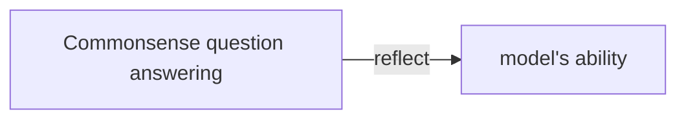
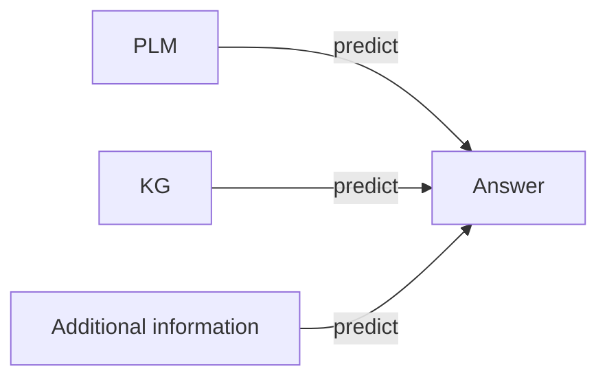
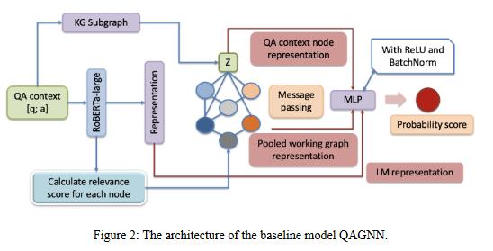
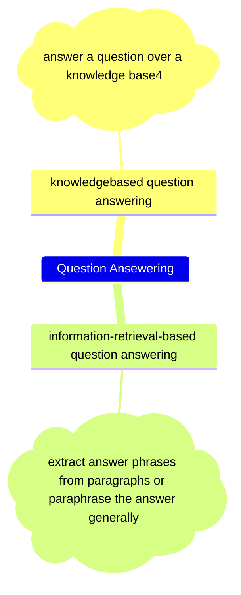

# Answer Prediction for Commonsense Multiple-Choice Questions by Utilizing Pretrained Language Model, Knowledge Graph and Additional Information

Paper Author: **LI Jiaxin**             Note Author: **XIONG Zhipeng**

> - 

## Abstract

**Why do we use Commonsense QA to test Model's Capability?**

**Flow-chart:**

- encode the question and choices as QA context
- retrieve subgraphs of the knowledge graph from the large knowledge graph **ConceptNet**
- calculate the relevance score between QA context and KG nodes

## Introduction

<dl>
  <dt>Question answering model</dt>
  <dd>a deep learning model that could answer questions in a given context</dd>

  <dt>Natural language processing</dt>
  <dd>concerned with building systems that automatically answer questions posed by humans in a natural language</dd>
</dl>

## Related Work

### QAGNN 
Encoder: RoBERTa-large model

