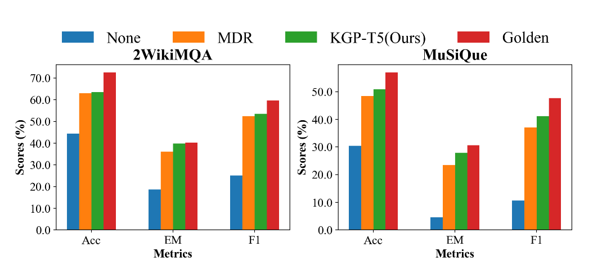
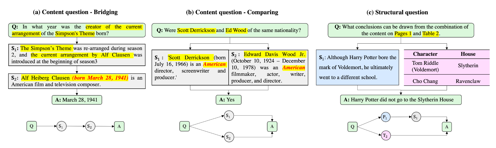

# Knowledge Graph Prompting for Multi-Document Question Answering

Yu Wang,1 Nedim Lipka,2 Ryan A. Rossi,2 Alexa Siu,2 Ruiyi Zhang,2 Tyler Derr1

- [Abstract](#abstract)

## Abstract

- The 'pre-train, prompt, predict' paradigm of large language models (LLMs) has achieved remarkable success in opendomain question answering (OD-QA)
- Few works explore this paradigm in multi-document question answering (MD-QA)

- This paper propose a Knowledge Graph Prompting (KGP) method to formulate the right context in prompting LLMs for MD-QA

**Graph Construction:** 
1. Nodes symbolizing passages or document structures
2. Edges denoting the semantic/lexical similarity between passages or document structural relations.

**Graph Traversal:**
1. An LLM-based graph traversal agent that navigates across nodes and gathers supporting passages assisting LLMs in MD-QA.
2. The constructed graph serves as the global ruler that regulates the transitional space among passages and reduces retrieval latency.

## Introduction

- The ‘**pre-train**, **prompt**, and **predict**’ paradigm has revolutionized natural language processing (NLP) in real-world applications, such as open-domain question answering, fact-checking, and arithmetic reasoning
- However, no significant efforts have investigated this framework in the scenario of multi-documental question answering (MD-QA), which enjoys practical usage in academic research, customer support, and financial/legal inquiries that require deriving insightful analysis from multiple documents

On 2WikiMQA and MuSiQue, directly prompting LLMs without providing any context, i.e., None, achieves only 25.07%/10.58% F1 and 18.60%/4.60% EM on 2WikiMQA/MuSiQue, which is far less than 59.69%/47.75% F1 and 40.20%/30.60% EM when prompting with supporting facts2 provided as contexts, i.e., the Golden one.

This demonstrates the limitation of fulfilling MD-QA using solely the knowledge encoded in LLMs.

**One common solution** to overcome this limitation in conventional OD-QA and single document question-answering (D-QA) is to retrieve grounding contexts and derive faithful answers from the contexts, i.e., retrieve-and-read.

However, unlike OD-QA and D-QA, **the primary challenge of MD-QA** roots in its demands for alternatively retrieving and reasoning knowledge across different documents

**Contributions:**

- Generally-applicable KG Construction
- Engaging KG for Prompt Formulation
- Case Studies Verifying MD-QA Framework

