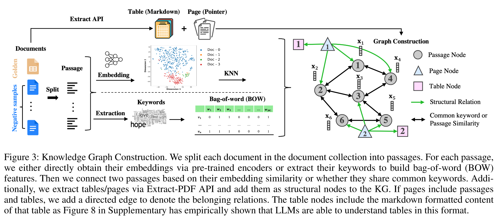
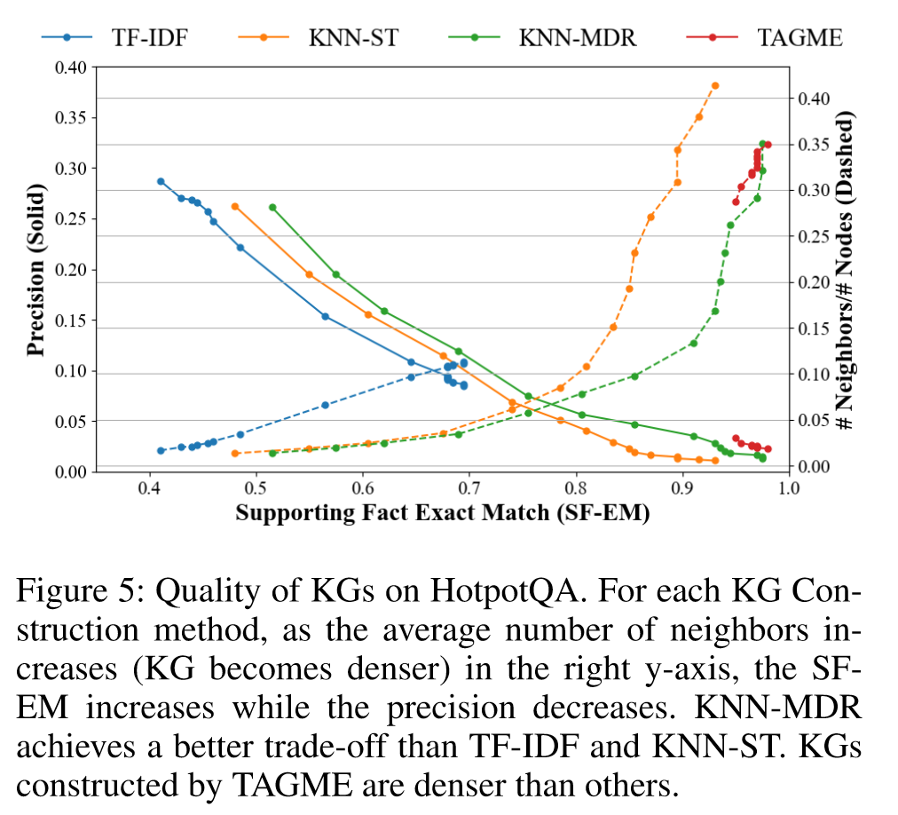
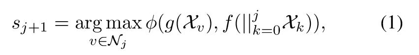
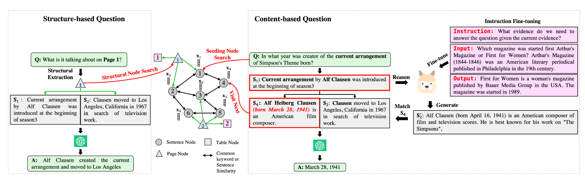
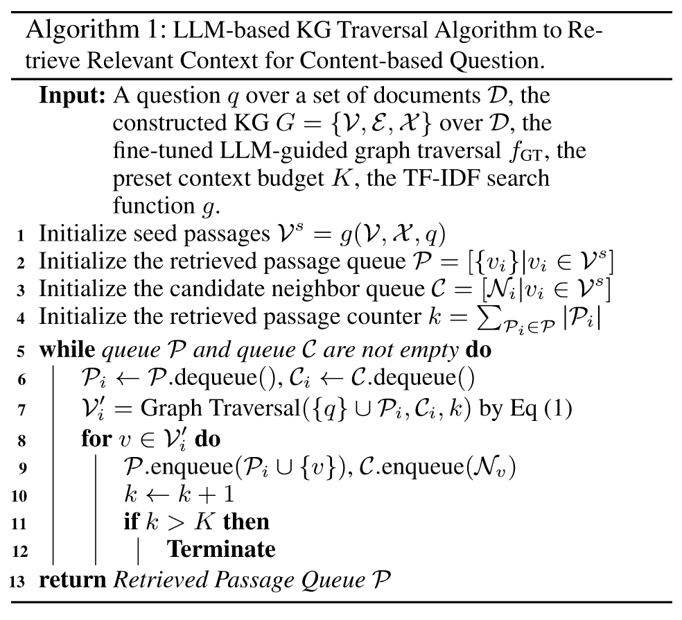
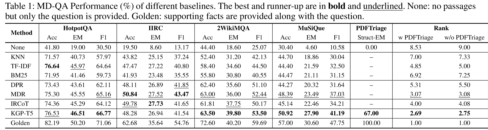
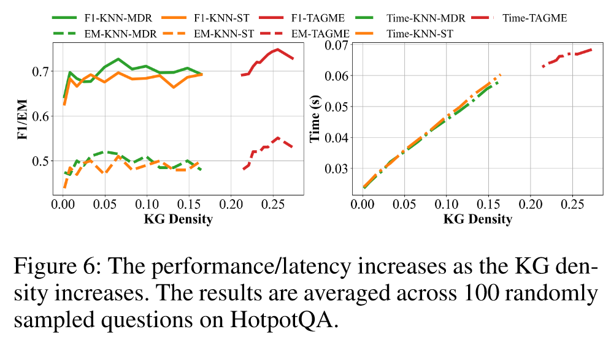
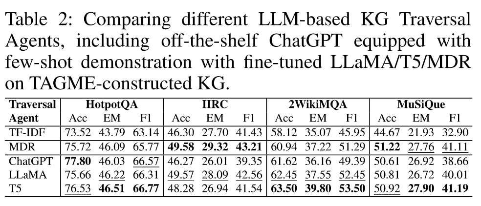
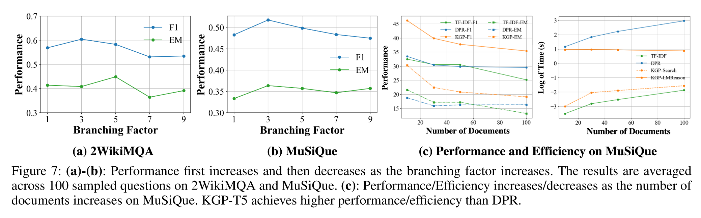
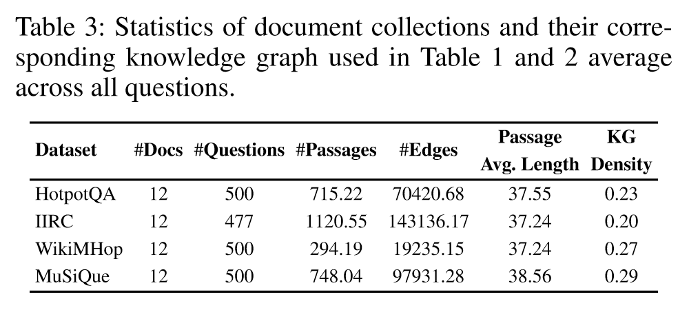

# Knowledge Graph Prompting for Multi-Document Question Answering

Yu Wang,1 Nedim Lipka,2 Ryan A. Rossi,2 Alexa Siu,2 Ruiyi Zhang,2 Tyler Derr1

- [Knowledge Graph Prompting for Multi-Document Question Answering](#knowledge-graph-prompting-for-multi-document-question-answering)
  - [Abstract](#abstract)
  - [Introduction](#introduction)
  - [Knowledge Graph Construction](#knowledge-graph-construction)
  - [LLM-based KG Traversal Agent](#llm-based-kg-traversal-agent)
  - [Experiment](#experiment)
    - [Performance Comparison on MD-QA](#performance-comparison-on-md-qa)
    - [Impact of the Constructed Graph](#impact-of-the-constructed-graph)
    - [Impact of Graph Traversal Agent](#impact-of-graph-traversal-agent)
    - [Sensitivity Analysis](#sensitivity-analysis)
  - [Related Work](#related-work)
  - [Conclusion](#conclusion)
- [Supplementary](#supplementary)
  - [Dataset Collection](#dataset-collection)

## Abstract

- The 'pre-train, prompt, predict' paradigm of large language models (LLMs) has achieved remarkable success in opendomain question answering (OD-QA)
- Few works explore this paradigm in multi-document question answering (MD-QA)

- This paper propose a Knowledge Graph Prompting (KGP) method to formulate the right context in prompting LLMs for MD-QA

**Graph Construction:** 
1. Nodes symbolizing passages or document structures
2. Edges denoting the semantic/lexical similarity between passages or document structural relations.

**Graph Traversal:**
1. An LLM-based graph traversal agent that navigates across nodes and gathers supporting passages assisting LLMs in MD-QA.
2. The constructed graph serves as the global ruler that regulates the transitional space among passages and reduces retrieval latency.

## Introduction

- The ‘**pre-train**, **prompt**, and **predict**’ paradigm has revolutionized natural language processing (NLP) in real-world applications, such as open-domain question answering, fact-checking, and arithmetic reasoning
- However, no significant efforts have investigated this framework in the scenario of multi-documental question answering (MD-QA), which enjoys practical usage in academic research, customer support, and financial/legal inquiries that require deriving insightful analysis from multiple documents

On 2WikiMQA and MuSiQue, directly prompting LLMs without providing any context, i.e., None, achieves only 25.07%/10.58% F1 and 18.60%/4.60% EM on 2WikiMQA/MuSiQue, which is far less than 59.69%/47.75% F1 and 40.20%/30.60% EM when prompting with supporting facts2 provided as contexts, i.e., the Golden one.

This demonstrates the limitation of fulfilling MD-QA using solely the knowledge encoded in LLMs.

**One common solution** to overcome this limitation in conventional OD-QA and single document question-answering (D-QA) is to retrieve grounding contexts and derive faithful answers from the contexts, i.e., retrieve-and-read.

However, unlike OD-QA and D-QA, **the primary challenge of MD-QA** roots in its demands for alternatively retrieving and reasoning knowledge across different documents

**Contributions:**

- Generally-applicable KG Construction
- Engaging KG for Prompt Formulation
- Case Studies Verifying MD-QA Framework

## Knowledge Graph Construction

**Nodes:** passages/pages/tables
**Edges:** lexical/semantic similarity

- **TF-IDF KG Construction:** Apply TF-IDF keyword extraction over each document to filter out meaningless words such as supporting verbs and articles, which also reduces the dimension of bag-of-word (BOW) features, sparsifies the constructed graph and increases the graph traversal efficiency. Add the document title into the extracted keyword set since some questions focus on title entities. Collect the extracted keywords from all documents to form the keyword space W and then connect two passages if they share any common keyword in W.
- **KNN-ST/MDR KG Construction:** Employ pre-existing models such as sentence transformers to generate passage embedding Xi for each node vi and subsequently compute pairwise similarity matrix to construct the K-nearest neighbor (KNN) graph. We follow the training strategy of MDR and train a sentence encoder by predicting the subsequent supporting facts based on previously supporting facts, thereby endowing the encoder with reasoning capability.
- **TAGME:** Employ TAGME to extract Wikipedia entities from each passage and construct the graph based on whether two passage nodes share common Wikipedia entities.

Structural nodes, extracting document structures via Extract-PDF.

The feature of page nodes is the page number and we add directed edges from it to sentence/table nodes in that page.

To **verify** the constructed KGs indeed encode the necessary information for MD-QA, randomly sample questions from HotpotQA and construct KGs over the set of documents for each of these questions using our proposed methods.

## LLM-based KG Traversal Agent

Fine-tune a large language model (LLM) to guide the knowledge graph traversal towards the next most promising passages in approaching the question based on the visited passages, which we term as the LLMbased KG traversal agent.

Given a question **q** asking about the document content, the LLM-based graph traversal agent reasons over previously visited nodes/retrieved passages ${\{s_k\}}^j_{k=0}$ and then generates the next passage s~j+1~ as follows:

## Experiment

- **Q1**:  How well does KGP perform MD-QA compared with existing baselines?
- **Q2**: How do the quality of the constructed KG and the LLM-based graph traversal agent impact the MD-QA performance?

### Performance Comparison on MD-QA

- The baselines ‘None/Golden’ achieve the worst/best performance because one provides no context and the other provides the golden context.
- All other baselines achieve the performance in-between because the retrieved context only covers the partial of the golden supporting facts.

###  Impact of the Constructed Graph

### Impact of Graph Traversal Agent

### Sensitivity Analysis

- In Figure 7(a)-(b), the performance first increases as the branching factor increases because more passage nodes selected from the candidate neighbors lead to more reasoning paths to reach the final answer.

- Furthermore, we compare the efficiency of KGP when the constructed KG includes different numbers of documents in Figure 7(c). KGP consistently achieves higher performance than other baselines and higher efficiency than embedding-based DPR. TF-IDF is slightly faster than KGP because it is a purely heuristic-based method.

## Related Work

**Question answering:** aims to provide answers to users’ questions in natural language, and most QA systems are composed of information retrieval (IR) and answer extraction (AE).

- **Information Retrieval(IR):** the system searches for query-relevant factual passages using heuristic methods(BM25) or neural-ranking ones (DPR). 
- **Answer Extraction(AE):** the final answer is extracted usually as a textual span from related passages.

## Conclusion

- Answering multi-document questions demands knowledge reasoning and retrieving from different documents across various modalities, presenting challenges for applying the paradigm of ‘pre-train, prompt and predict’ with LLMs.
- Recognizing the logical associations among passages and structural relations within documents, we propose a Knowledge Graph Prompting method (KGP) for aiding LLMs in MD-QA.
- The KGP constructs KGs from documents with nodes as sentences or document structures, and edges as their lexical/semantic similarity/structural relations.
- Since constructed KGs may contain irrelevant neighbor information, we further design an LLM-based graph traversal agent that selectively visits the most promising node in approaching the question.

# Supplementary

## Dataset Collection

**Document Set Collection and Procession:** 
1. As no previous works focus on MD-QA, we create our own datasets to simulate real-world scenarios where users maintain folders containing various documents and pose questions to which the answers are only from certain parts of these documents. 
2. To imitate this scenario, we randomly sample questions from the development set of existing datasets: **HotpotQA/IIRC/2WikiMQA/MuSiQue**, and then for each specific question, we fetch documents from Wikipedia that encompass supporting facts pertaining to the question and term these documents as **golden documents**.
3. Then we randomly sample negative documents from Wikipedia and pair them with golden documents to constitute the document collection.
4. For each document in the collected document set, we split it into multiple passages with the default passage length being 250 as it empirically yields superior performance.
5. As questions from these existing datasets only focus on document contents, we additionally incorporate the ‘PDFTriage’ dataset, an internal company collection of real-world questions focusing on document structures.

**Knowledge Graph Construction:** 
We construct a knowledge graph for each question and its corresponding collection of documents.

- For datasets where the questions are from Wikipedia: HotpotQA, IIRC, WikiMHop, and Musique, we only have passage nodes since answering questions in these datasets does not require information about document structures.
- For the PDFTriage dataset, in addition to passage nodes, we apply ExtractAPI to obtain the page and table information so that the constructed KG also has pages/tables as nodes.

**Sequential Data Collection:** 
- directly follow MDR and use the preprocessed HotpotQA data from the GitHub Repository5 to train the encoder and apply it to other datasets that do not provide the sequential order of supporting facts.
- For instruction fine-tuning LLaMA, we still use the above HotpotQA data and rearrange it into the instruction-input-output format and use the instruction ‘What evidence do we need to answer the question given the current evidence’. We present one example in Listing 1
- For T5-large, we use the same input-output but prefix the reasoning instruction to the input following the original T5 input format

