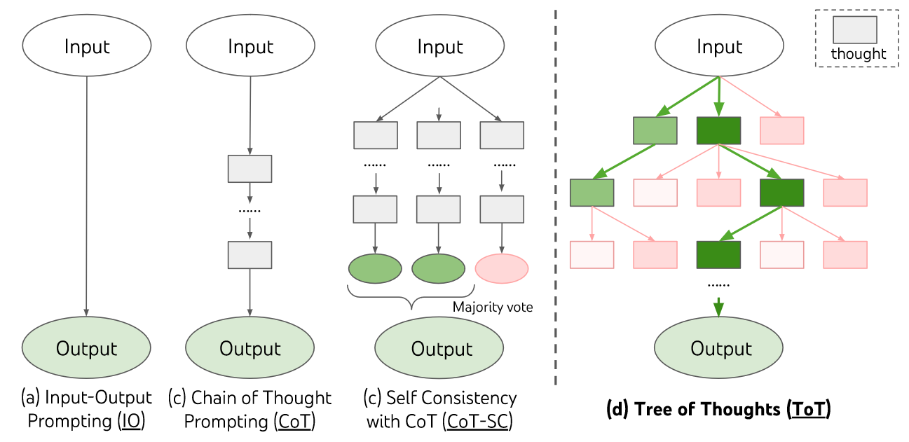
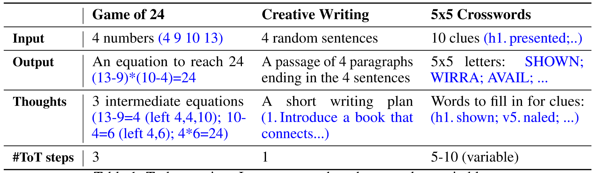

# Tree of Thoughts: Deliberate Problem Solving with Large Language Models

| Author Name | |
| - | - |
| Shunyu Yao | Princeton University |
| Dian Yu | Google DeepMind |
| Jeffrey Zhao | Google DeepMind |
| Izhak Shafran | Google DeepMind |
| Thomas L. Griffiths | Princeton University |
| Yuan Cao | Google DeepMind |
| Karthik Narasimhan | Princeton University |

- [Tree of Thoughts: Deliberate Problem Solving with Large Language Models](#tree-of-thoughts-deliberate-problem-solving-with-large-language-models)
  - [Abstract](#abstract)
  - [Introduction](#introduction)
    - [Motivation](#motivation)
    - [Method](#method)
    - [Framework](#framework)
    - [Task Overview](#task-overview)
    - [Results](#results)
  - [Background](#background)

## Abstract

**Challenge:**

Unable to tackle tasks that require exploration, strategic lookahead, or where initial decisions play a pivotal role.

**Method:**
<dl>
    <dt>Tree of Thoughts(ToT)</dt>
</dl>

**Advance:** 
1. generalizes over the popular “Chain of Thought” approach to prompting language models, and enables exploration over coherent units of text (“thoughts”) that serve as intermediate steps toward problem solving.
2. allows LMs to perform deliberate decision making by considering multiple different reasoning paths and self-evaluating choices to decide the next course of action, as well as looking ahead or backtracking when necessary to make global choices.

**Result:** ToT significantly enhances language models’ problem-solving abilities on three novel tasks requiring non-trivial planning or search: **Game of 24**, **Creative Writing**, and **Mini Crosswords**.

**Code repo with all prompts:** https://github.com/princeton-nlp/tree-of-thought-llm

## Introduction

### Motivation

1. The mechanism used for wide range of tasks, such as, requiring mathematical, symbolic, commonsense, and knowledge reasoning, is still the original **autoregressive mechanism**, which makes token-level decisions one by one and in a left-to-right fashion. 
2. Research on “dual process” models suggests that people have two modes in which they engage with decisions – a fast, automatic, unconscious mode (“System 1”) and a slow, deliberate, conscious mode (“System 2”).

### Method
1. System (1) maintains and explores diverse alternatives for current choices instead of just picking one
2. System (2) evaluates its current status and actively looks ahead or backtracks to make more global decisions.

### Framework

### Task Overview

### Results
1. ToT obtains superior results on all three tasks by being general and flexible enough to support **different levels of thoughts**, **different ways to generate and evaluate thoughts**, and **different search algorithms** that adapt to the nature of different problems.
2. analyze how such choices affect model performances via systematic ablations
3. discuss future directions to better train and use LMs

## Background

> - $p_{\theta}$ denote a pre-trained LM with parameters $\theta$
> - **lowercase letters** x,y,z,s &middot; &middot; &middot; to denote a language sequences, i.e x = (x[1], &middot; &middot; &middot;,x[n] ) where each x[i] is a token, so that $$p_{\theta}(x) = \prod\limits_{i=1}^{n} p_{\theta}(x[i]|x[1...i])$$
> - **uppercase letters** S, · · · to denote a collection of language sequences

<dl>
    <dt>Input-output (IO) prompting</dt> 
</dl>

is the most common way to turn a problem input x into output y with LM: $$y \sim p_{\theta}(y|{prompt}_{IO}(x))$$ 
where ${prompt}_{IO}(x)$ wraps input x with task instructions and/or few-shot input-output examples.

For simplicity, $$p_{\theta}^{prompt}(output|input) = p_{\theta}^{prompt}(output|prompt(input)) $$
So, IO prompting: $y \sim p_{\theta}^{IO}(y|x)$

<dl>
  <dt>Chain-of-thought (CoT) prompting</dt>
</dl>
was proposed to address cases where the mapping of input x to output y is non-trivial (e.g. when x is a math question and y is the final numerical answer).

<dl>
  <dt>Self-consistency with CoT (CoT-SC)</dt>
</dl>

is an ensemble approach that samples k i.i.d.chains of thought: 
$[z_{1...n}^{i},y^{(i)}] \sim p_{\theta}^{CoT}(z_{1...n},y|x)(i=1...k)$

