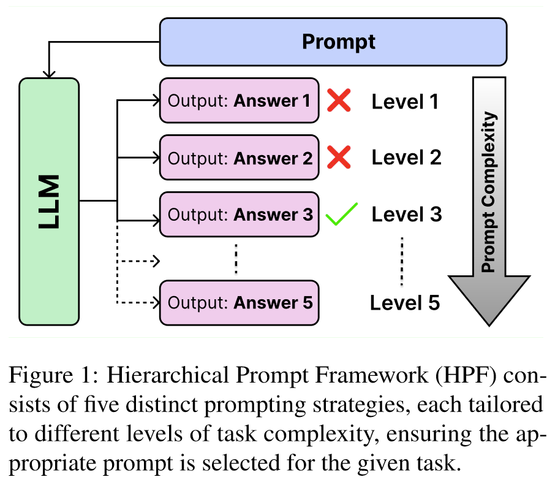
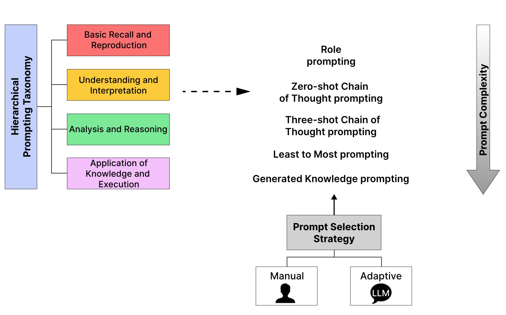
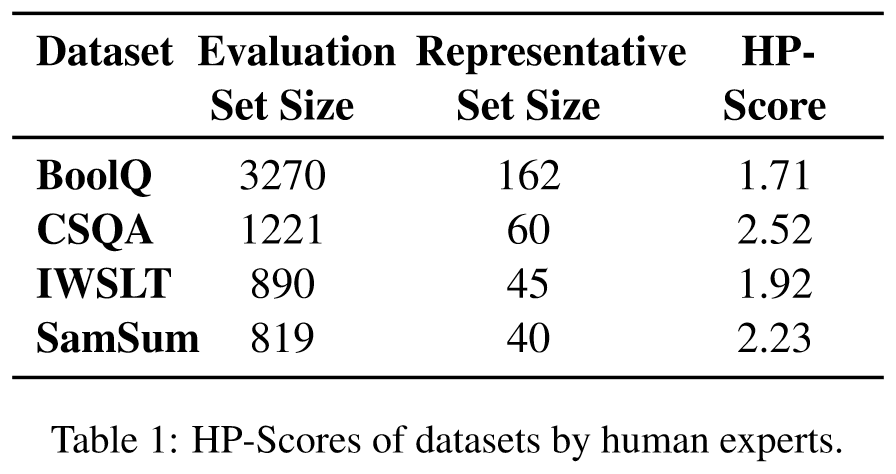
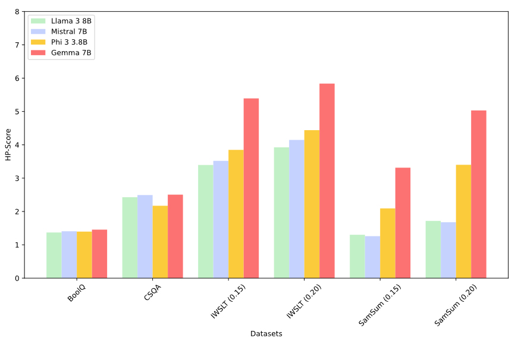
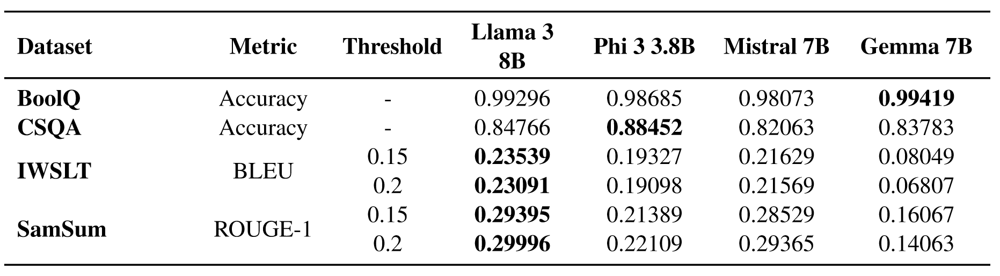
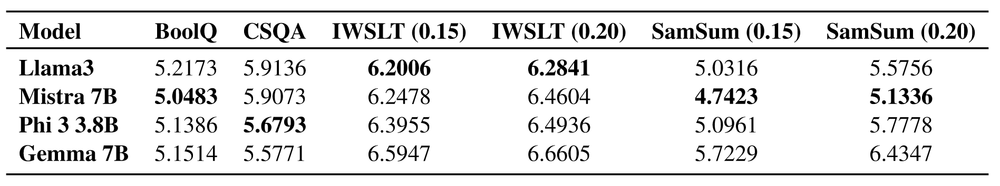
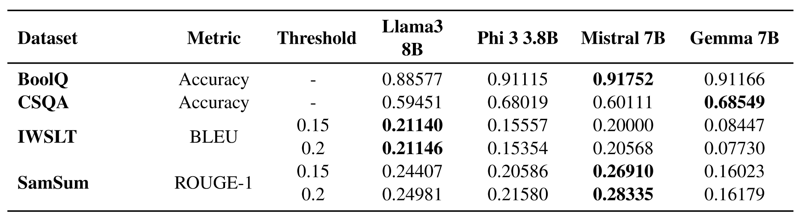

**Hierarchical Prompt Framework (HPF)**

**Models:** Llama 3 8B, Phi 3 3.8B, Mistral 7B, and Gemma 7B
**Datasets:** BoolQ, CommonSenseQA (CSQA), IWSLT-2017 en-fr (IWSLT), and SamSum

- **BoolQ** consists of approximately 16,000 True/False questions with corresponding passages from Wikipedia, designed for binary classification in reading comprehension
- **CSQA** contains around 12,000 multiple-choice questions sourced from ConceptNet, aimed at evaluating model’s commonsense reasoning abilities.
- **IWSLT** is a parallel corpus with tens of thousands of EnglishFrench sentence pairs from TED Talks, used for machine translation tasks.
- **SamSum** features around 16,000 human-generated chat logs with summaries, facilitating dialogue summarization model development.

# Which problem is addressed by the paper?

- Traditional prompting strategies, which apply the same prompt to all dataset samples regardless of task complexity, often result in sub-optimal evaluations.

# Why is it important?

Traditional prompting strategies' limitation highlights the need for more sophisticated evaluation methods that can adapt to varying levels of task complexity.

# How is it solved?

Hierarchical Prompt Framework (HPF) employs five distinct prompting strategies, each tailored to different levels of task complexity.

Furthermore, the taxonomy incorporates an Adaptive Hierarchical Prompt framework, enabling an LLM, called prompt-selector to dynamically select the appropriate prompting strategy based on a given task complexity.

**taxonomy criteria:**
- **Basic Recall and Reproduction:** Remember and reproduce factual information without interpretation or analysis
- **Understanding and Interpretation:** Comprehend and explain the meaning of information, summarizing or clarifying content.
- **Analysis and Reasoning:** Break down complex information, understand relationships, and solve problems using logical reasoning.
- **Application of Knowledge and Execution:** Apply knowledge in practical situations, execute multi-step processes, and solve complex tasks.

**The five different prompting strategies that make up the HPF are :**
- **Role Prompting:** Prompts that define a role for the LLM in solving the task.
- **Zero-Shot Chain-of-Thought Prompting (Zero-CoT):** Prompts that use the phrase "Let’s think step by step" without providing prior examples to encourage critical thinking and problem-solving
- **Three-Shot Chain-of-Thought Prompting (3-CoT):** Prompts that offer three examples to guide the LLM’s reasoning process.
- **Least-to-Most Prompting:** Prompts that sequentially breakdown the task into sub problems to derive essential insights from the task in order to solve it.
- **Generated Knowledge Prompting (GKP):** Prompts that require the integration of external knowledge to accomplish the task. Llama 3 8B was used to generate the necessary knowledge. Unlike the original study, the knowledge prediction with the highest confidence score was selected among three possible predictions.

The Manual HPF systematically iterates through the predefined levels of prompting strategies to solve a given task using the language models. This process involves starting with the simplest prompts and gradually progressing to more complex ones based on the prompt hierarchy levels until the task is successfully addressed.

A *prompt-selector* determines which prompting strategy is most suited for a given task in the adaptive HPF.

HP-Score is an evaluation metric for assessing the complexity of a task in comparison to various categories of problem-solving agents, such as humans and LLMs, which is heavily influenced by HPT rules.

**HP-Score for Datasets**
Datasets are evaluated by scoring each sample of a representative set of 5% of the original evaluation dataset on a scale from 1 (lowest) to the number of prompting levels (highest) existing in HPF for each of the four HPT rules. HP-Score for datasets is computed as:
$$hp_j = \frac{1}{4}\sum_{i=1}^{4} {a_i} $$
$$ HP-Score_{Dataset} = \frac{1}{n}\sum_{j=1}^{n}{hp_j}$$

where a~i~ represents the individual score for each rule of HPT, hp~j~ represents the HP-Score of sample j and n denotes the total number of samples in the representative set.

**HP-Score for Manual HPF**
HPF categorizes prompting strategies based on their complexity into five levels: Role Prompting (level 1), Zero-CoT (level 2), 3-CoT (level 3), Least-to-Most Prompting (level 4), and GKP (level 5). Each level has a score of the same value as the level, i.e. for level x, score = x.

A LLM’s superior task-solving ability is indicated by a lower HP-Score. If the LLM fails to address the task at all levels of prompts, it is assigned a penalty corresponding to its dataset HP-Score. If the LLM was able to address the task at level x:
$$hp_j = x $$
If LLM was unable to address the task after all m levels:
$$hp_j = m + {HP-Score}_{Dataset} $$
HP-Score for Manual HPF is:
$HP-Score_{Manual} = \frac{1}{n}\sum_{j=1}^{n}{hp_j} $

where hp~j~ represents the HP-Score of sample j, x represents the level of HPF at which task is addressed, m represents the total number of levels in HPF, and n denotes the total number of samples in the evaluation set.

**HP-Score for Adaptive HPF**
The prompt-selector can dynamically select the most suitable prompting strategy for a given task’s complexity from the manual HPF’s collection of prompting strategies.

Table 3 shows the evaluation scores for each LLM across all datasets using the Manual HPF.

Despite having the fewest parameters, phi 3 3.8B achieved the lowest HP-Score among all four LLMs while also achieving the highest accuracy.

**Results for Adaptive HPF**
The Adaptive HPF automates the selection of appropriate prompting strategy for each task using a prompt-selector utilizing Llama 3 8B for the experiments.

Table 4 shows the HP-Scores

Table 5 presents the evaluation scores for the LLMs using the adaptive HPF.

The findings presented in Figure 4 show that, on all datasets, the adaptive HPF produces HP-Scores for the LLMs that are higher than those obtained with the manual HPF, with decreased evaluation scores. Higher HP-Scores demonstrate that adaptive HPF is obviously unable to complete a variety of tasks, with the primary cause being hallucinations when choosing the appropriate level of prompting by the *prompt-selector*.

# DataAnalysis, Applications, Conclusion and Future Work

