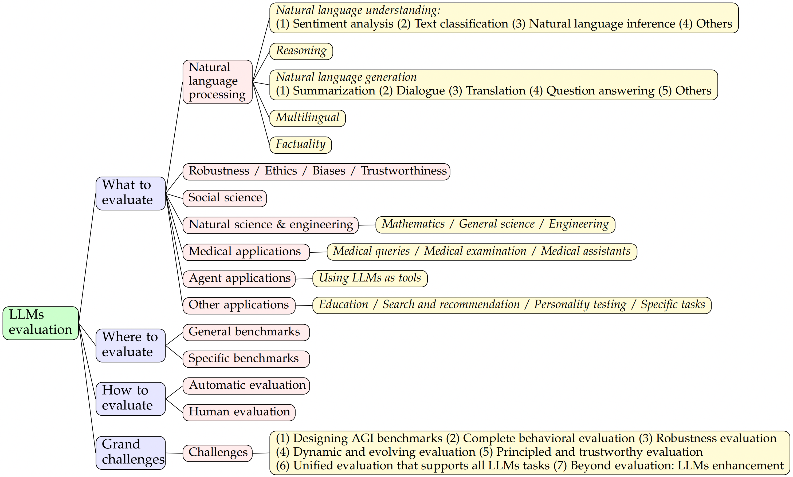

# Note on Paper-"A Survey on Evaluation of Large Language Models"

Name: **XIONG, ZHIPENG**

Email: zhipeng@akane.waseda.jp
*University of Electronic Science and Technology of China*

Three keys dimensions:
- what to evaluate
    "what to evaluate" encapsulates existing evaluation tasks for LLMs
- where to evaluate
    "where to evaluate" involves selecting appropriate datasets and benchmarks for evaluation
- how to evaluate
    "how to evaluate" is concerned with the evaluation process given appropriate tasks and datasets

How to develop this review:
1. Overview from the perspective of evaluation tasks.
2. Diving into the evaluation methods and benchmarks to answer the ***"where"*** and the ***"how"*** questions.
3. Summarize the sucess and the failure cases of LLMs in different tasks.
4. Challenges in LLM evalution

https://github.com/MLGroupJLU/LLM-eval-survey

## Introduction

Understanding the essence of intelligence and establliching whether a machine embodies it poses a compelling question for scientists. 

Within the scope of AI, the Turing Test has been a longstand objective in AI evolution.

LLMs are been used across both academic and industrial domains.

## Background

### Large Language Models

Language models(LMs) are computational models that have the capability to understand and generate human language. LMs have the transformative ability to predict the likelihood of word sequences or generate new text based on a given input.

**Shortcomings**
1. the issue of rare or unseen words
2. the problem of overfitting
3. the difficulty in capturing complex linguistic phenomena

Large Language Models(LLMs) are advanced language models with massive parameter sizes and exceptional learning capabilities.

The core modules behind many LLMs is the self-attention module in Transformer. Transformers have revolutionized the field of NLP with their ability to handle sequential data efficiently, allowing for parallelization and capture long-range dependencies in text.

Prompt Engineering  is a common approach to interacting with LLMs, where users design and provide specific prompt texts to guide LLMs in generating desired responses or completing specific tasks.

|Comparison | Traditional ML | Deep Learning | LLMs |
|------ |------ |------ |------|
|Training Data SIze | Large | Large | Very Large |
|Feature Engineering | Manual | Automatic | Automatic |
|Model Complexity | Limited | Complex | Very Complex |
|Interpretability | Good | Poor | Poorer |
|Performance | Moderate | High | Highest |
|Hardware Requirements | Low | High | Very High |

### AI Model Evaluation

There are some standard model evaluation protocols:
1. k-fold cross-validation
2. holdout validation
3. leave one out cross-validation(LOOCV)
4. bootstrap
5. reduced set

As LLMs are becoming more popular with even poorer interpretability, existing evaluation protocols may not be enough to evaluate the true capabilities of LLMs thoroughly.

## What to evaluate

What tasks should we evaluate LLMs to show their performance? On what tasks can we claim the strengths and weaknesses of LLMs?

Divde existing tasks into the following categories:
- natural language processing
- robustness
- ethics
- biases and trustworthiness
- social sciences
- natural science and engineering
- medical applications
- agent application
- other applications

### Natural Language Processing Tasks

The initial objective behind the development of language models, particularly large language models, was to enhance performance on natural language processing tasks, enccompassing both understanding and generation.

#### Natural language understanding

1. **Sentiment analysis** is a task that analyzes and interprets the text to determine the emotional inclination.
    LLMs have demonstrated commendable performaance in sentiment analysis tasks, but the abilty of ChatGPT to understand low-resource languages is limited.

2. **Text classification** not only focuses on sentiment, but also includes the processing of all texts and tasks.
    LLMs perform well on text classification task and can even handle text classificatioin tasks in unconventional problem settings as weell.

3. **Natural language inference(NLI)** is the task of determining whether the given "hypothesis" logically follows from the "premise".

4. **Semantic understanding** refers to the meaning or underrstanding of language and its associated concepts.
    The performance of LLMs in semantic understanding tasks is poor.

#### Reasoning

The reasoning performance of ChatGPT is different.

#### Natural language generation

NLG evaluates the capabilities of LLMs in generating specific texts, which consists of several tasks, including summarization, dialogue generation, machine translation, question answering, and other open-ended generation tasks.

