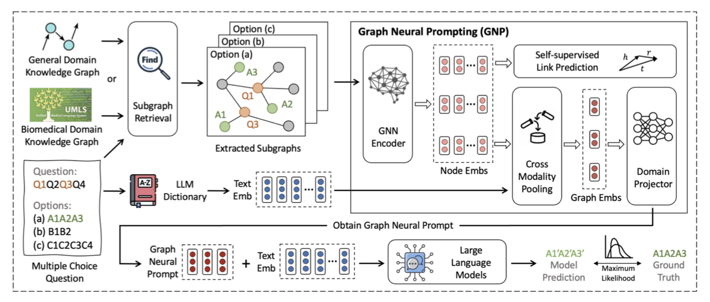

# Note on "Graph Neural Prompting with Lage Language Models"

## Abstract

1. LLMs exhibit inherent limitations in precisely capturing and return grounded knowledge
2. How to use grounded knowledge, e.g., retrieval-augmented generation, to enhance pre-trained? Although existing work has explored utilizing knowledge graphs(KGs) to enhance language modeling via joint training and customized model architectures, applying this to LLMs is problemtic owing to. their large number of parameters and. high computational cost.
3. This paper proposes **Graph Neural Prompting(GNP)**, a plug-and-play method to assist pre-trained LLMs in learning beneficial knowledge from KGs.

## Introduction

LLMs have exceptional performance and general capability in various NLP tasks and use cases such as question answering and text summarization.

Prompt-based adaptation methods are proposed to modulate a frozen LLM's behavior through prompts.

Existing methods have incorporated KGs to assist language modeling, often by **designing customized model architectures** to accommodate both KGs and textual data, followed by joint training sessions. **Nonetheless**, joint training KGs and text for LLMs is challenging due to the extensive parameters LLMs contain and the substantial computation resources they require. A direct approach to **employing KGs for retrieval-augmented generation** is to feed the KG triples into LLMs directly. However, this mehod can introduce substantial noise, given that KGs might conntain various extraneous contexs.

The paper proposes Graph Neural Prompting(GNP) to learn beneficial from KGs and integrate them into pre-trained LLMs. GNP retrieves and encodes the pretinent grounded knowledge to derive Graph Neural Prompt, an embedding vector that can be sent into LLMs to provide guuidance and instructions. In particular, GNP first utilizes a GNN to capture and encode the intricate graph knowledge into entity/node embeddings. Then, a cross-modality pooling module is present to determine the most relevant node embeddings in relation to the text input, and consolidate these node embeddings into a holistic graphlevel embedding. After that, GNP encompasses a domain projector to bridge the inherent disparrities between the graph and text domains. Finally, a self-supervised link prediiction objective is introduced to enhance the model comprehension of releationships between entities and capture graph knowledge in a self-supervised manner.

Evaluate model on multiple public benchmark datasets, and the GNP can improve the reslut of fine tuning.

## Preliminary

***Definition 1. Knowledge Graph.*** 
A knowledge graph is defined as $\mathbf{G = (\sigma, R, T)}$, where &sigma; is the set of entities and R is the set of relations. T is the collection of fact triples ${(e_h, r, e_t)} \in \sigma \times R \times \sigma$, where e~h~ denotes the head entity, r is the relation, and e~t~ indicates the tail entity.

***Problem 1. Multiple Choice Question Answering.*** Given a question Q, a set of answer options $A = {\{a_k\}}^{K}_{k=1}$, and an optional context C depending on open-book or close-book, the task is to design a machine learning model $F_\theta$ with parameters &theta; that selects the best option to answer the question. Here K denotes the total number of answer options and a~k~ indicates the k-th answer option. The ground truth label $y \in A$ is the correct answer option. The ground truth label $y \in A$ is the correct answer for Q. In addition, we use knowledge G to provide rich. knowledge and assist the model to answer the question.

## Methodology

1. Prompting LLMs for question answering
2. subgraph retrieval
3. Graph Nerual Prompting and its components and designs

### Prompting LLMs for Questions Answering

- hard prompt: textual input
- soft prompt: form of the learnable embedding vectors

Graph Neural Prompting encodes structural and fctual information contained in the knowledge graph G

### Subgraph Retrieval
1. For each answer options a~k~ and its corresponding context C and question Q, first obtain a set of matched entities E~match~ via entity linking too match the tokens in X to the entities in G. 
2. Then, retrieve a subgraph G^'^ based on the entities in E~match~ by including their two-hop neighbors and the relations that connect them. 

### Graph Neural Prompting
#### GNN Encoder
Use GNN to encode the most relevant knowledge and further integrate the complex relationships among the entities
1. Use pre-trained enntity embeddings to intialize the node embeddings
2. Employ a standard graph attention network as GNN encoder for the retrieved subgraph G^'^ to get H~~ node embeddings

#### Cross-modality Pooling
Aim to identify the most pertinent nodes.
1. Use the internal graph characteristics and the implicit inteeractions among nodes to dynamically identify node significance to get H~2~ node embeddings

2. Leverage the textual prompt to calculate the importance of nodes within the graph.

#### Domain Projector
Aim to bridge the inherent disparities between graph and text.

#### Self-supervised Link Prediction
Refine its understanding of releationships between entities and capture graph knowledge.