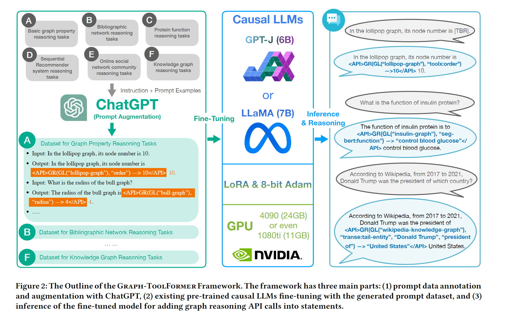

# Note on "Graph-ToolFormer To Empower LLMs with Graph Reasoning Ability via Prompt Augmented by ChatGPT"

## Abstract
- LLMs present very serious flaw in graph reasoning tasks.
- This paper proposes the GRAPH-TOOLFORMER(Graph Reasoning oriented Toolformer) framework to teach LLMs themselves with prompts augmented by ChatGPT to use external graph reasoning API tools.

## Introduction

- Researchers ignored graphs since graph has long-time been merely use as an intermediate modeling data structure for real-world.
- This paper proposes **Graph-Toolformer** to incorprate graph data into LLms for various graph reasoning tasks.
- This paper aim to empowerr the existing LLMs with the ability to overcome the weakness in their performance when handling graph structured data  for complex graph reasoning tasks.
- ***Contributions***
  - Graph Reasoning with LLMs
  - Graph Reasoning Prompt Dataset
  - Extensive Experimental Studies
  
## Related Work
### Graph Neural Networks
- GNNs aim to learn the wmbedding epresentations of the graph structured data.

### Lnguaage Models
### Prompt Tuning
- Prompts aree efffective i tuning the pre-trined language models.

## Notation, Terminology Definition and Problem Formulation
- Attribute Calculation
- Node Classification
- Graph Classification
- Link Prediction
- Graph Partition/Clustering
- Graph Searching

## Proposed Method
### Framework Outline
 
 ###  Prompt with API Calls
 