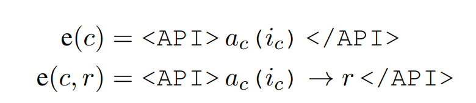

# Note on "Toolformer: Languge Models Can Teach Themselves to Use Tools"

## Abstract
Language models(LMs) struggle with basic functionality, such as arithmetic or factual lookup, where much simpler and smaller models excel.

This paper introduce ***Toolformer***, a model trained to decide which APIs to call, to teach LLMs themselves to use external tools via APIs.

## Introduction
- All of these models have serveral inherent limitation, including an inability to access up-to-date information on recent events, the related tendency to hallucinate facts.
- This paper proposes ***Toolformer*** to overcome these limitation.
  - Given just a handful of human-written examples of how an API can be used, we let a LM annotate a huge language modeling dataset with potential API calls
  - Use a self-supervised loss to determine which of these API calls actually help the model in predicting future tokens.
- The approach is agnostic of the dataset being used, so this method can be applied to the exact same dataset that was used to pretrain a model in the first place.

## Approach
- The inputs and ouutputs for each API should be represented as text sequences.
- each API call as a tuple c = (a~c~, i~c~) where a~c~ is the name of the API and i~c~ is the corresponding input.  
  -  where "<API>", "</API>" and "&rightarrow;" are special tokens.
- **Sampling API Calls**
- **Executing API Calls**
- **Filtering API Calls**
- 