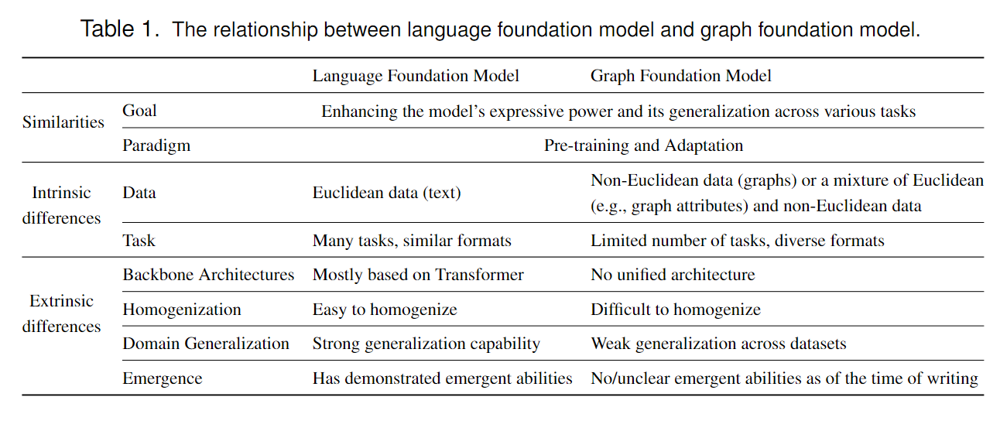

# Towards Graph Foundation Models: A Survey and Beyond

## Introduction
Foundation Model
: Model is trained on broad data and can be adapted to a wide range of downstream tasks.

1. ***GNN-based Models***: They aim to enhance existing graph learning paradigms through innovations in the backbone, pre-training, and adaption aspexts.
2. ***LLM-based Models***: They explore the feasibility of using an LLM as a graph foundation model by converting graphs into text or tokens
3. ***GNN+LLM-based Models***: They explore various forms of synergy between GNNs and LLMs to enpower them with enhanced capabilities.

## Background
### Deep Graph Learning
#### Graph Data
1. ***Non-Euclidean Nature***: it lacks the rigid geometric structure found in traditional data formats.
2. ***Various Domains***
3. ***Various Types***

#### Backbone Architectures
#### Learning Paradigms
1. Supervised learning
2. Semi-supervised Learning
3. Unsupervised Learning

### Language Foundation Models
#### Language Data
#### Backbone Architectures
#### Learning Paradigms

## Graph foundation models
### Concepts of Graph Foundation Model
#### Definition and Key Characteristics
Graph foundation model
: Model is expercted to benefit from the pre-training of broad graph data, and can be adapted to a wide range of downstream graph tasks.

***Emergence*** means that the graph foundation model will exhibit some new abilities when having a large parameters or trained on more data, which are also referred to as emergent abilities.
***Homogenization*** means that the graph foundation model can be applied to different formats of tasks.

### Comparsion with Language Foundation Model
