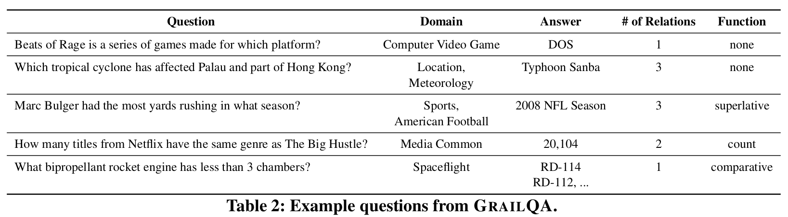

|Datasets| SOTA Model| Link| SOTA Scores | Challenging|
|--------|-----| ----|----------  | --- |
|Strongly Generalizable Question Answering(GrailQA)| Bert & T5 | [GrailQA](https://dki-lab.github.io/GrailQA/) [SOTA paper](https://aclanthology.org/2023.acl-long.270/)| Leaderboard: Overall(EM:73.418, F1:81.869), Compositional Generalization(EM:74.806, F1:82.293), Zero-shot Generalization(EM:71.575, F1:78.536)| The dataset is a KBQA dataset with 64,331 questions annotated with both answers and corresponding logical forms in different syntax (i.e., SPARQL, S-expression, etc.). This places requirements on the model's understanding ability.|

|--------|-----| ----|----------  | --- |